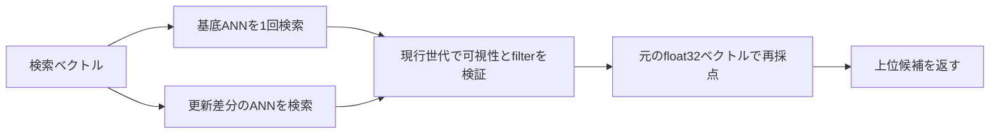

# ANN検索の基底スナップショットと更新差分

この文書では、ベクトル検索でセグメント数に比例してANN検索を繰り返さないための構造、更新世代との
整合、再構築、監視方法、性能測定結果を説明します。検索リクエストとスコアの意味は
[検索](search.md)、セグメントと世代の一般的な関係は
[セグメント、世代、検索スナップショット](segments-and-generations.md)を参照してください。

## 変更前と変更後

変更前は、ベクトルを持つ全セグメントの`vectors.usearch`を検索し、各セグメントの候補を最後に
統合していました。1000セグメントなら、絞り込みによる再試行を除いても1検索あたり1000回の
ANN検索が必要でした。

変更後は、公開済みスナップショットの可視ベクトルを一つにまとめた「基底ANN」と、基底の作成後に
追加・置換された「更新差分」を検索します。



通常時のANN呼び出し回数は、基底の1回と更新差分セグメント数の合計です。基底に含まれたセグメントが
1000個でも、基底側の呼び出し回数は1回です。

## 基底ANNと検索計画

coreはベクトル対応索引を開くと、各セグメントの可視な本文断片ベクトルを一つのUSearch索引へ
登録します。内部キーの上位32ビットは基底作成時のセグメント通し番号、下位32ビットは本文断片の
通し番号です。候補のID、親文書、スコアはこのキーだけから信用せず、現行スナップショットの
`documents.yap2`と`vectors.yap2`へ戻して検証します。

世代を読み替えるときは、基底へ記録したセグメントIDとdescriptorの指紋を現行マニフェストへ
照合し、次の検索計画を作ります。

- IDとdescriptorが同じセグメントは基底ANNから検索します。
- 新規セグメントとdescriptorが変わったセグメントは更新差分として、そのセグメントのANNを検索します。
- 現行マニフェストから外れた基底セグメントの候補は使用しません。
- 同じ文書IDの新しい版または削除標識がある場合は、基底に残る古い候補を可視性検証で除外します。
- `filter`は候補が属する現行セグメントのメタデータへ評価します。

基底ANNでは最初に`candidate_k`の4倍まで候補を取得します。更新や削除、`filter`によって有効候補が
不足した場合は取得数を倍増し、必要件数を得るか基底の全件数へ達するまで再試行します。ANNが返した
距離値を利用者向けスコアには使わず、`vectors.yap2`のfloat32値から`cosine`、`dot`、`l2`の
スコアを再計算します。

## 更新中の検索と基底の再構築

文書更新は従来どおり、新しいセグメントとマニフェスト世代を原子的に公開します。検索開始時に取得した
スナップショットはリクエスト終了まで変わらないため、検索途中で旧世代と新世代の候補が混ざることは
ありません。新世代を読み替えた直後は新しいセグメントを更新差分として検索できるため、基底の再構築を
待たずに更新結果を返せます。

coreは次のいずれかを満たすと基底を再構築します。

- 更新差分セグメントが8個を超えました。
- コンパクションなどにより、基底に含まれるセグメントが現行マニフェストから外れました。

再構築中も検索は現在の基底と更新差分を使えます。候補の構築が終わると、対象にした世代が現在も同じか
確認し、短い排他区間で基底と検索計画を一緒に交換します。構築中に別の世代が公開されていた場合は候補を
交換せず、次の保守周期で作り直します。このため、検索側から途中まで作られた基底は見えません。

## 再起動用の派生キャッシュ

基底ANNは索引直下の次の2ファイルへ派生キャッシュとして保存します。

| ファイル | 内容 |
|---|---|
| `ann-base.usearch` | 全基底ベクトルを持つUSearch索引です。 |
| `ann-base.yap2` | 世代、距離尺度、次元数、ベクトル数、対象セグメントIDとdescriptor指紋、`ann-base.usearch`のサイズとSHA-256を持ちます。 |

一時ファイルを`fsync`してから名前変更し、メタデータを最後に公開します。起動時は共通ヘッダー、CRC32C、
設定、世代、USearchファイルのサイズとSHA-256を検証します。ファイルがない、壊れている、設定と合わない
場合は、マニフェストが参照する正式なセグメントから基底を再構築します。
複数プロセスが同じ索引を開いた場合は`ann-base.lock`の`flock`で2ファイルの公開を直列化します。

この2ファイルは`manifest.yap2`から参照される正式データではありません。バックアップから省略しても
検索内容は失われませんが、復元後の最初の起動では再構築のCPU時間と一時的なメモリーが必要です。

## 計算量とメモリー

基底に含まれるセグメント数を`S`、更新差分数を`D`、可視ベクトル総数を`N`とすると、ANN呼び出し回数は
変更前の概ね`S`回から、通常は`1 + D`回になります。`D`は再構築条件により通常8以下へ戻ります。
HNSW内部の探索量は`N`とデータ分布に依存しますが、セグメントを増やしただけで同じ検索を1000回
起動する固定費はなくなります。

代わりに、各セグメントのANNに加えて基底ANNをメモリーへ保持します。再構築中は旧基底と構築中の
新基底が一時的に共存します。大規模なベクトル索引では、通常時と再構築時のRSSを実データで測り、
余裕のあるメモリー容量を確保してください。

## 監視

`/health/ready`の`ann`と`/metrics`から、基底世代、基底ベクトル数、更新差分数、候補除外、再試行、
再構築の成功・失敗を確認できます。特に次を監視します。

- `yappod_v2_ann_delta_segments`が8を超えたまま戻らない場合は、再構築失敗とcoreのログを確認します。
- `yappod_v2_ann_missing_base_segments`が0へ戻らない場合は、コンパクション後の再構築が完了していません。
- `yappod_v2_ann_search_calls_total{kind="delta"}`が検索件数に対して増え続ける場合は、更新差分が残っています。
- `yappod_v2_ann_candidates_total{result="rejected"}`は更新、削除、絞り込みで古い候補を除外した累計です。

全フィールドとメトリクスの定義は[監視とメトリクス](observability.md)を参照してください。

## 1000セグメント性能測定

2026年8月7日に`v2_ann_segment_benchmark`で、総数100000、32次元、`top_k = 10`の同じ
疑似乱数ベクトルを1、10、100、1000セグメントへ均等分割して測定しました。各構成は5回の事前実行後に
101回測定しています。変更前相当は各セグメントのANNから最大40候補を得て統合し、変更後相当は
全体ANNを1回検索して最大40候補を得ます。Recall@10の正解集合は全100000ベクトルの総当たりです。

測定端末はMacBook Air、Apple M4 10コア、メモリー32 GB、macOS 26.6、Apple clang 21.0.0です。
個人名、端末名、シリアル番号、ローカルファイルパスは記録していません。

| セグメント数 | 方式 | ANN呼び出し/検索 | 中央値 | p95 | 中央値から算出したQPS | Recall@10 |
|---:|---|---:|---:|---:|---:|---:|
| 1 | 全セグメント個別 | 1 | 0.069 ms | 0.079 ms | 14492.75 | 0.9891 |
| 1 | 基底 | 1 | 0.111 ms | 0.123 ms | 9009.01 | 0.9931 |
| 10 | 全セグメント個別 | 10 | 0.560 ms | 0.600 ms | 1785.71 | 0.9980 |
| 10 | 基底 | 1 | 0.159 ms | 0.179 ms | 6289.31 | 0.9931 |
| 100 | 全セグメント個別 | 100 | 2.891 ms | 3.215 ms | 345.90 | 1.0000 |
| 100 | 基底 | 1 | 0.173 ms | 0.189 ms | 5780.35 | 0.9931 |
| 1000 | 全セグメント個別 | 1000 | 9.968 ms | 10.181 ms | 100.32 | 1.0000 |
| 1000 | 基底 | 1 | 0.179 ms | 0.197 ms | 5586.59 | 0.9931 |

1000セグメントでは、ANN呼び出し部分の中央値が約55.7分の1になりました。基底方式の中央値は
セグメント数10〜1000で0.159〜0.179 msに収まり、セグメント分割数への比例増加を避けています。
一方、1セグメントでは探索幅を64から128へ増やした基底の方が0.042 ms遅く、Recall@10は
0.9891から0.9931へ上がりました。

このQPSは単一プロセス内のANN候補取得と再採点だけを`1000 / 中央値ms`で換算した値です。HTTP解析、
スナップショット参照、レスポンス生成、同時実行、ネットワークを含むYappod2サーバーのRPSではありません。
総当たり正解計算と索引構築も計測区間から除外しています。1000セグメント構成のプロセス最大RSSは
約171.5 MiBでしたが、旧方式と基底方式を同一プロセスへ同時に構築した比較用ベンチマーク全体の値であり、
本番runtimeの必要量を表しません。

再実行する場合は次のコマンドを使います。

```sh
cmake --build build --target v2_ann_segment_benchmark -j
./build/v2_ann_segment_benchmark \
  --segments 1000 \
  --vectors 100000 \
  --dimensions 32 \
  --iterations 101 \
  --top-k 10
```

## 自動試験

`ann_corpus_v2`は1000セグメントを作り、変更前相当が1000回、基底方式が1回のANN検索になること、
上位10件の一致、キャッシュ再読込、キャッシュ破損の検出を確認します。`http_v2_runtime`は9世代の
連続更新、基底再構築、同一文書の再更新、メタデータ変更、削除を通して、古い候補を返さないことを
確認します。

```sh
ctest --test-dir build -R '^(ann_corpus_v2|http_v2_runtime|ann_v2|v2_search_quality)$' \
  --output-on-failure
```
