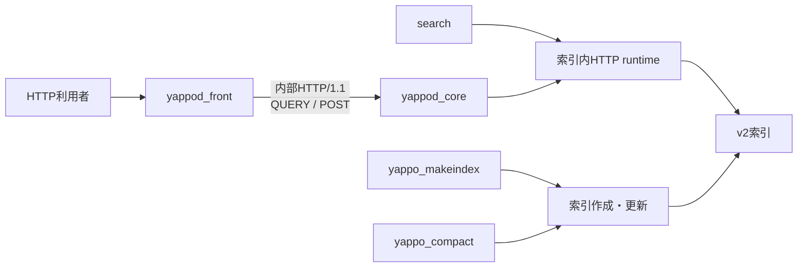
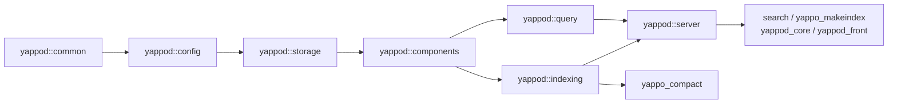
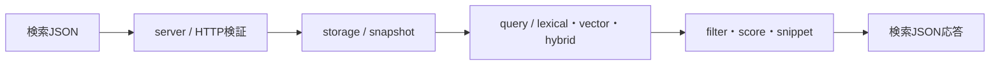
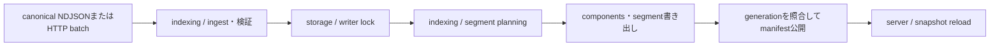

# Yappod2アーキテクチャ

この文書は、Yappod2の内部構造、依存方向、主要な処理経路、変更時に確認する一次資料をまとめた
開発者向けの地図です。利用者向けの操作仕様は各リファレンス文書を優先し、内部ターゲットと
ソースの対応はルートの`CMakeLists.txt`を優先します。

## 初見で読む順番

1. 利用目的と実行例を[ルートREADME](../README.md)で確認します。
2. この文書の「プロセス構成」と「内部ライブラリ」を読み、変更対象の責務を決めます。
3. 「変更箇所地図」から、利用者向け契約を定める正式文書と対応テストを確認します。
4. 実装前に対象ディレクトリの`AGENTS.md`と
   [開発と品質確認](development.md)を読みます。
5. 複数PR、引き継ぎ、後続課題を伴う場合は
   [タスク票と開発作業の運用](task-workflow.md)に従います。

## 契約境界

### 利用者向け契約

次は、変更を明記して合意しない限り維持する契約です。

- `search`、`yappo_makeindex`、`yappo_compact`、`yappod_core`、`yappod_front`の名前、引数、
  終了状態、標準出力、標準エラー。
- TOML設定、canonical NDJSON、公開HTTP API、front/core内部通信、メトリクス。
- `config.toml`、`manifest.yap2`、`segments/<segment-id>/`から成るv2索引形式。
- インストールされる実行ファイル、設定ファイル、利用者向けの操作手順。

これらの一次資料は、[コマンドリファレンス](command-reference.md)、
[設定リファレンス](configuration.md)、[索引作成](indexing.md)、
[索引形式](index-format.md)、[索引の更新と保守](index-lifecycle.md)、
[`yappod_front` API](yappod-front-api.md)、
[frontとcoreの通信仕様](yappod-core-protocol.md)、
[監視とメトリクス](observability.md)です。

### 変更可能なC契約

すべてのCヘッダー、型、構造体の形、関数、シンボル、ソース互換性、ABIは内部契約です。
インストール対象かどうかにかかわらず、責務と所有関係を明確にするため変更できます。CMake内部
ターゲット、ライブラリ名、テストのリンク方法、ソースパスも内部契約です。

旧C APIを維持するためだけの互換ヘッダー、alias、wrapperは原則として追加しません。C APIを
変更するときも、利用者向け契約を変えないタスクでは、シリアライズされる値、公開設定、CLI、
HTTP応答、索引形式の結果を維持します。

## プロセス構成

- `search`はネットワークデーモンを起動せず、`server`のHTTP実行層をプロセス内で呼びます。
- `yappo_makeindex`は`prepare`、`build`、`update`、`verify`を振り分けます。`verify`は索引の
  runtimeを開いてsnapshotの状態を確認します。
- `yappo_compact`はmanifest上の隣接範囲から最終文書と削除標識を集め、その範囲だけを
  新しいsegment群へ置き換えます。
- `yappod_front`は公開HTTP、認証、処理上限、運用endpointを担当します。検索、取得、登録は
  `yappod_core`へ転送します。
- `yappod_core`は内部HTTPを検証し、索引runtimeへ検索、取得、更新を依頼します。
  独立した保守スレッドはマニフェストdescriptorから小セグメント数を定期確認し、設定した閾値を
  超えた場合だけ範囲コンパクションとruntime再読み込みを実行します。

公開HTTPと内部HTTPの正確なmethod、path、header、状態コードは
[frontとcoreの通信仕様](yappod-core-protocol.md)を参照してください。

現在の構成を複数front、複数core、水平シャード、レプリカへ拡張する将来設計は
[クラスタ構成計画](cluster-architecture-plan.md)に分離しています。同文書の機能は未実装であり、
現在の動作を説明するものではありません。

## 内部ライブラリと依存方向

内部実装は7個のstatic libraryに分かれます。次の図は左の下位責務から右の上位責務を構成する
順序を示します。`query`と`indexing`は互いに依存しません。

CMake上のリンクは上位ライブラリから許可された直下の下位ライブラリへ向きます。

| 責務 | ソース | 主な所有物 | 直接依存できる内部責務 |
|---|---|---|---|
| `common` | `src/common/` | 状態、byte・document・passage基本型、共通上限、I/O、ネットワーク、Unicode | なし |
| `config` | `src/config/` | 索引設定、アプリケーション設定、実行時制限、設定検証 | `common` |
| `storage` | `src/storage/` | file header、segment、manifest、snapshot、writer lock、compaction状態 | `config` |
| `components` | `src/components/` | lexical、metadata、embedding、vector、ANNの永続化と読み出し | `storage` |
| `query` | `src/query/` | BM25、filter、snippet、lexical・vector・hybrid検索、retrieve、RAG | `components` |
| `indexing` | `src/indexing/` | ingest、build、update、segment planning、compact | `components` |
| `server` | `src/server/` | HTTP実行、front/core通信、observability | `query`、`indexing` |

実行ファイルは`src/app/`にあり、必要な最上位ライブラリだけへ直接リンクします。許可された内部
リンクはCMake configure時に検査し、includeの方向はCTestの`source_dependency_rules`で
検査します。循環が必要に見える場合は逆向き依存を追加せず、共有型または処理を適切な下位責務へ
移します。

## 主要な処理経路

### build

`yappo_makeindex build`はアプリケーション設定を読み、入力operationを検証し、segment単位へ計画
します。lexical、metadata、vector、ANNなどのcomponentを書き出し、検証済みのmanifestを最後に
公開します。正式入力と公開順序は[索引作成](indexing.md)と
[索引形式](index-format.md)を参照してください。

### search

`server`は要求を内部の検索条件へ変換し、現在のsnapshotと各segmentのcomponentを`query`へ
渡します。ベクトル検索では、runtimeが所有する基底ANNを1回検索し、基底作成後の更新差分だけを
segment単位で追加検索します。`query`は検索方式ごとの候補を作り、可視性、filter、score、hybrid統合を適用します。
`server`が文書情報、snippet、cursorを応答JSONへ整形します。検索意味論は
[検索](search.md)、基底ANNの所有と再構築は
[ANN検索の基底スナップショットと更新差分](ann-search.md)を参照してください。

### retrieve

retrieveはpassageを対象に検索した後、`query`の取得処理が上位候補を文書単位の上限と
`max_context_bytes`へ収め、contextとcitationを組み立てます。HTTPの要求・応答契約は
[`yappod_front` API](yappod-front-api.md)、検索とRAG向け取得の意味論は
[検索](search.md)を参照してください。

### update

CLI更新とHTTP登録は同じindexing処理へ収束します。現在generationを前提に新しいsegmentを準備し、
component検証後にmanifestを公開します。失敗時に途中の候補を正式snapshotとして扱いません。
詳細は[索引の更新と保守](index-lifecycle.md)を参照してください。

### compact

`indexing`はcompaction lockでcompact同士を直列化し、writer lock内でmanifest上の隣接範囲を
選びます。writer lockを解放して範囲内の最終文書または削除標識から新しいsegment群を作成し、
再取得したwriter lock内で選択descriptorの一致を確認して、その範囲だけを置換します。構築中に
末尾へ追加された更新segmentは候補manifestへ残します。進行状態は`storage`へ保存され、
`server`の運用endpointとメトリクスが読み出します。

### front/core通信

`yappod_front`は公開要求を解析し、検索と取得を`QUERY`、文書batchを`POST`として
`yappod_core`へ送ります。`yappod_core`は内部method、path、header、本文上限を検証し、同じ
`server`の索引runtimeを呼び出します。live、ready、metricsとprepareの扱いは検索転送と異なるため、
変更時は必ず[frontとcoreの通信仕様](yappod-core-protocol.md)と`tests/server/`を照合します。

## 変更箇所地図

| 変更目的 | 実装責務 | 契約資料 | 主な対応テスト |
|---|---|---|---|
| 状態値、基本値型、Unicode、I/O上限 | `common` | `index-format.md`、`indexing.md` | `tests/common/`、`tests/storage/index_v2_contracts_test.c` |
| TOMLキー、既定値、相対パス、実行時上限 | `config` | `configuration.md` | `tests/config/` |
| file header、segment、manifest、snapshot、lock | `storage` | `index-format.md`、`index-lifecycle.md` | `tests/storage/` |
| lexical、metadata、embedding、vector、ANNの保存と読出し | `components` | `index-format.md`、`configuration.md` | `tests/components/` |
| BM25、filter、snippet、検索順位、retrieve | `query` | `search.md`、`yappod-front-api.md` | `tests/query/`、`tests/quality/` |
| canonical NDJSON、build、update、segment計画、compact | `indexing` | `indexing.md`、`index-lifecycle.md` | `tests/indexing/`、`tests/acceptance/` |
| 公開HTTP、内部HTTP、runtime reload、メトリクス | `server`と`app` | `yappod-front-api.md`、`yappod-core-protocol.md`、`operations.md`、`observability.md` | `tests/server/`、`tests/acceptance/` |
| CLIの引数、出力、終了状態、install結果 | `app`とCMake | `command-reference.md`、`INSTALL` | `tests/acceptance/` |
| search-webの画面、仲介API、外部埋め込み・LLM | `examples/search-web/` | exampleの`README.md`と`docs/` | 同exampleの`client`、`server/test`、`tests/e2e.mjs` |
| local-filesまたはWikipediaの入力生成 | 対象example | 対象exampleの`README.md` | 対象exampleの`tests/` |

表にない変更でも、利用者向け契約に触れる場合は関連する正式文書、単体テスト、受け入れテストを
同時に確認します。保存形式またはプロトコルを変更するタスクでは、単一の実装テストだけでなく、
旧データや別プロセスとの境界を確認する受け入れ手順をタスク票へ明記します。
