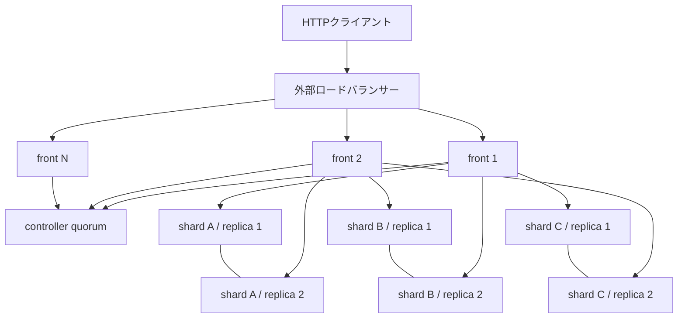

# Yappod2クラスタ構成計画

この文書は、Yappod2を単一の`yappod_front`と`yappod_core`で動かす現在の構成から、複数の
front、複数のcore、文書の水平シャード、レプリカ、必要に応じた検索機能の垂直分割を持つ構成へ
発展させるための設計計画です。

この文書で説明するクラスタ機能は将来計画であり、現在の実行ファイル、設定、HTTP APIにはまだ
実装されていません。現在利用できる構成は[アーキテクチャ](architecture.md)、
[設定リファレンス](configuration.md)、[frontとcoreの通信仕様](yappod-core-protocol.md)を
一次資料とします。

クラスタ化の前に、一つのcoreプロセス内でネットワークI/O、検索計算、更新、保守を分離します。
この単一端末の実装順序と負荷試験は
[単一端末runtimeの並列実行設計](single-node-runtime-design.md)を一次資料とします。同じ索引を開く
複数coreプロセスは単一端末のCPU使用率を上げる手段にせず、複数プロセスは水平シャードまたは異なる
障害ドメインのレプリカを所有する段階で導入します。

## 目標

クラスタ化では、次の状態を目指します。

- frontを複数台へ増やし、外部HTTPの受付能力と可用性を増やせます。
- 文書集合を複数の水平シャードへ分割し、1台のcoreが保持できる文書数、メモリー、ディスク容量を
  クラスタ全体の上限にしません。
- 同じシャードのレプリカを複数台のcoreへ配置し、検索負荷を分散しながら、1台の障害で検索不能に
  ならない構成を作れます。
- 1回の検索は、同じクラスタ公開世代に属する全シャードだけを使います。更新、コンパクション、
  再配置の途中状態を混ぜません。
- BM25F、ベクトル検索、複合検索の候補をクラスタ全体で順位付けし、シャードの境界による不合理な
  順位変化を防ぎます。
- 更新batchは複数シャードへ分かれても、利用者から見て全件が反映されるか、1件も反映されないかの
  どちらかになります。
- 文書数を増やすときはcoreの台数を増やし、各coreが担当する索引サイズと検索処理量を適正範囲に
  保てます。
- さらに大きな構成で必要性が確認された場合は、語彙検索、ANN、文書取得を別のcore群へ垂直分割
  できます。

クラスタ化だけで単発検索を無制限に高速化することは目標にしません。全シャード検索の応答時間には、
最も遅いシャードの処理時間、ネットワーク往復、frontでの統合時間が含まれます。単発検索の内部並列化、
索引方式の変更、検索対象シャードの絞り込みは別の最適化として扱います。

## 用語

| 用語 | 意味 |
|---|---|
| クラスタ | 同じ論理索引を提供するcontroller、front、coreの集合です。 |
| controller | クラスタカタログ、配置、リース、更新トランザクションを管理する制御プレーンです。 |
| front | 公開HTTPを受け付け、対象シャードを決め、coreへ並列要求し、候補を統合する検索コーディネーターです。 |
| 水平シャード | 文書IDのハッシュ範囲で分割した文書集合です。一つの文書と、その本文断片、語彙、ベクトル、メタデータ、削除標識は同じ水平シャードへ置きます。 |
| シャードグループ | 同じ水平シャードを保持するprimaryとreplicaの集合です。 |
| primary | あるシャードの更新を準備し、ローカル世代を公開する権限を持つcoreです。 |
| replica | primaryと同じ公開スナップショットを保持し、検索を処理できるcoreです。primaryも検索用レプリカの一つとして扱えます。 |
| ローカル世代 | 一つの水平シャードまたは垂直partition内の`manifest.yap2`が持つ世代です。 |
| クラスタ公開世代 | 検索に使用する全partitionのローカル世代、全体統計、配置を一つに固定した通し番号です。本文では`cluster_epoch`と表記します。 |
| 水平分割 | 文書集合を複数coreへ分け、保持容量と検索処理量を分散することです。 |
| 垂直スケール | 1台のcoreへ割り当てるCPU、メモリー、ディスク、ワーカースレッドを増減することです。データの分割ではありません。 |
| 垂直分割 | 語彙検索、ベクトル検索、文書・本文断片取得などを別のcore群へ分けることです。 |

「垂直スケール」と「垂直分割」は別の操作です。この文書では、最初に全検索componentを同じ水平
シャードへ置き、必要性を性能測定で確認した後だけ垂直分割します。

## 現在と目標の違い

| 観点 | 現在 | 目標 |
|---|---|---|
| frontの接続先 | `core_host`と`core_port`の1組です。 | カタログから全シャードと利用可能なレプリカを取得します。 |
| frontの役割 | 1台のcoreへ要求を転送します。 | scatter、候補統合、再採点、再試行、期限管理を行います。 |
| coreの索引 | 一つの索引ディレクトリを開きます。 | 一つのシャードレプリカ、または一つの垂直partitionを所有します。 |
| 世代 | 一つの`manifest.yap2`の世代です。 | `cluster_epoch`がシャードごとのローカル世代を参照します。 |
| 更新 | 一つのwriter lockとmanifest公開で完了します。 | 影響する全シャードで準備した後、クラスタカタログで一度だけ公開します。 |
| BM25F統計 | 一つのスナップショット内の全セグメントを集計します。 | 全水平シャードの論理文書集合を集約した統計を使います。 |
| ANN | core内の基底ANNと更新差分を検索します。 | 各水平シャードで基底ANNと更新差分を検索し、frontが候補を統合します。 |
| 障害 | coreが停止すると検索できません。 | 同じ世代を持つ別レプリカへ切り替えます。 |

既存のcoreの前へ通常のロードバランサーを置くだけでは、水平シャード検索になりません。異なる文書を
持つcoreへ要求を一つだけ振り分けると、検索対象の一部しか調べないためです。水平シャードではfrontが
全対象シャードへ要求を送り、結果を統合します。

## 確定する設計原則

| 番号 | 原則 |
|---|---|
| 1 | frontは公開APIと分散検索を担当し、文書・索引ファイルの正本を保持しません。 |
| 2 | coreはシングルプロセス・マルチスレッドを基本とします。シャードレプリカを配置と所有権の単位にし、初期構成では1プロセスへ1レプリカを割り当てます。同じサーバーで複数coreプロセスを動かせます。 |
| 3 | 文書は文書IDから求めた安定したハッシュ値で水平シャードへ割り当てます。同じ文書の更新と削除は必ず同じシャードへ送ります。 |
| 4 | 検索時は各シャードから、指定した`cluster_epoch`を保持するレプリカを一つ選びます。レプリカ数を増やしても1検索あたりのfan-out数は増やしません。 |
| 5 | controllerは3台以上の奇数台で構成し、多数決でカタログ、リース、commit記録を永続化します。制御データと検索データを同じものとして扱いません。 |
| 6 | coreが持つセグメントは公開後に変更しません。現在のmanifest、snapshot、基底ANN、更新差分、コンパクションの設計をシャード内部で再利用します。 |
| 7 | frontは一部のシャードだけから得た結果を正常な検索結果として返しません。部分結果APIは、明示的な利用者契約を別途設計するまで追加しません。 |
| 8 | BM25Fはクラスタ共通統計で採点し、複合検索のRRFは全シャードの語彙順位とベクトル順位を作った後に適用します。 |
| 9 | 複数シャードにまたがる更新batchは、トランザクションIDとクラスタcommit記録によって不可分に公開します。 |
| 10 | 水平シャードとレプリカを完成させるまで、語彙、ANN、メタデータ、本文を垂直分割しません。 |

## 目標トポロジー



外部ロードバランサーは正常なfrontへだけ公開要求を送ります。frontはcontrollerから取得した検証済み
カタログをメモリーへ保持し、検索ごとに一つのカタログスナップショットを固定します。通常の検索では
controllerへ同期問い合わせしません。

## 各プロセスの責務

### controller

controllerは次を管理します。

- `cluster_id`、論理索引ID、索引設定の指紋
- `cluster_epoch`と、その世代が参照する全ローカルスナップショット
- シャードのハッシュ範囲、primary、replica、配置先、障害ドメイン
- coreとfrontのnode ID、内部endpoint、対応プロトコル版、容量、状態
- primaryリースと単調増加するfencing token
- 更新トランザクションのprepare、commit、abort記録
- クラスタ共通統計の識別子とチェックサム
- クラスタ共通統計の基底、更新差分、論理版、配置版
- シャード分割、統合、移動、レプリカ追加、回収の作業状態
- 公開済み世代を安全に回収できる時点

controllerは検索候補、文書本文、ベクトルを処理しません。controllerの多数決が失われても、frontとcoreが
保持する最後の検証済みカタログによる検索は、設定した猶予時間内で継続できます。更新、配置変更、primary
昇格、新しい`cluster_epoch`の公開は停止します。

### front

frontは次を担当します。

- 公開HTTP、認証、入力検証、公開APIの処理上限
- controllerカタログの監視と、検証済みスナップショットのキャッシュ
- 検索対象となる水平シャードと垂直partitionの決定
- 期限とキャンセルを引き継いだcoreへの並列要求
- 同じシャード内のレプリカ選択、障害時の別レプリカへの再試行
- 語彙候補とベクトル候補の全体順位、RRF、決定的な同点順序
- `retrieve`の全体順位、本文断片の取得、`max_context_bytes`に基づくcontext構築
- クラスタカーソルの検証
- 更新batchのシャード分割と分散トランザクションの調整
- front自身と下流coreごとの処理上限、通信量、遅延の監視

frontは原則としてステートレスです。処理中要求、接続プール、統計artifactのローカルファイル、問い合わせで
参照した語のbounded memory cache、カタログのメモリーキャッシュは持ちますが、再起動時に失ってはならない
正本を持ちません。

### core

coreは次を担当します。

- 割り当てられたシャードレプリカのローカル索引、manifest、snapshot
- 語彙検索、filter、ANN候補取得、元のfloat32ベクトルによる再採点
- 指定された`cluster_epoch`に対応するローカル世代の検証
- primaryの場合の更新prepare、ローカルmanifest公開、レプリカ転送
- シャード内部の基底ANN再構築、コンパクション、検証
- ローカルディスク上の未公開、一時、旧世代データの安全な回収
- controllerへのheartbeat、保持世代、容量、処理能力、異常状態の報告

coreの検索処理は複数のpthreadで複数CPUコアを使います。1プロセスのCPU使用率が頭打ちになった場合は、
同じサーバーへ別シャードのcoreプロセスを追加できます。プロセス間で書き込み可能な索引ディレクトリを
共有しません。

非常に小さいシャードが多く、frontの接続数が問題になった場合は、一つのcoreプロセスが複数の独立した
シャードruntimeを所有できるように拡張します。この場合もmanifest、writer lock、処理枠、メトリクス、
primaryリースはシャードごとに分離し、一つの書き込み可能ディレクトリを複数プロセスで共有しません。

## 文書の水平シャード

文書の配置は、索引IDと文書IDから求めた安定したハッシュ値の範囲で決めます。ハッシュ方式、入力byte列、
byte orderは保存形式の契約として固定し、実装言語やプロセスによって結果が変わらないテストベクトルを
用意します。

各シャードは連続したハッシュ範囲を所有します。通常の検索は全範囲、文書IDを指定する更新と削除は一つの
範囲だけを対象にします。シャード数を増やすときは、既存範囲を二つの子範囲へ分割します。単純な
`hash % shard_count`は、シャード数の変更で大半の文書の配置が変わるため使用しません。

一つの文書について、次のデータは同じ水平シャードへ置きます。

- 文書ID、title、本文、本文断片
- 語彙postingと語彙統計のローカル材料
- filterに使うメタデータ
- 本文断片ベクトルとANN
- 更新前の旧版と削除標識

これにより、同じ文書IDの最新版判定、削除、filter、コンパクションをシャード内部で完結させます。

## レプリカと配置

シャードグループには一つのprimaryと、設定した数のreplicaを置きます。配置ではサーバー、ラック、
availability zoneなどの障害ドメインが異なるcoreを優先します。同じ物理サーバーの複数プロセスは、
可用性のための別レプリカとして数えません。

論理索引ごとに`replication_factor`と`commit_quorum`を持ちます。`commit_quorum`は
`replication_factor`以下でなければなりません。1台を失ってもcommit済みデータから回復する運用では、
各対象シャードについて異なる障害ドメインに少なくとも2個のpreparedコピーが存在するまでcommitしません。
開発用に冗長性を持たない構成を許す場合も、その構成では単一障害から更新データを保護できないことを
ready応答と運用情報へ明示します。

レプリカは次の順序で新しいローカル世代を受け取ります。

1. primaryが新しい不変セグメントと候補manifestを構築します。
2. セグメントを内容チェックサム付きでreplicaへ転送します。
3. replicaは一時領域へ保存し、サイズ、チェックサム、component構造を検証します。
4. replicaは候補snapshotを開けることを確認し、`prepared`を報告します。
5. 必要なレプリカ数が準備できた後だけ、更新トランザクションをcommitできます。
6. commit後に各coreがローカルmanifestを原子的に公開し、指定世代を検索可能として報告します。

検索時にfrontが選べるのは、要求した`cluster_epoch`のローカル世代を`ready`として報告したreplicaだけです。
単にプロセスが生存していることや、より新しいローカル世代を持つことだけでは選びません。

セグメント転送の初期実装はcore間の複製とします。将来、同じ不変オブジェクト契約を使う外部artifact
storageを追加できます。どちらの場合も検索はローカルディスク上の検証済みファイルを開き、検索経路で
共有ネットワークファイルシステムを直接読みません。

## クラスタカタログと世代

`cluster_epoch`は符号なし64ビット整数とし、新しい検索可能状態を公開するたびに増やします。値を0へ
戻しません。最大値到達時の扱いはローカル世代と同様に、新規公開を拒否して既存世代の検索を継続します。

カタログの一つの公開世代は、少なくとも次を含みます。

```text
cluster_epoch
index_id
index_config_fingerprint
shard_map_version
global_statistics_id
global_statistics_checksum
partitions[]:
  shard_id
  hash_range
  component_role
  local_generation
  manifest_checksum
  ann_layout_version
  replicas[]
```

`replicas[]`は、そのローカル世代を保持すべきnodeと配置状態を表します。瞬間的な接続可否、処理中件数、
deadline超過のようなlivenessは公開世代へ埋め込まず、controllerのnode状態とfrontの直近観測として別に
管理します。replicaの一時停止だけで文書集合とscoreを表す`cluster_epoch`を増やしません。
同じ論理文書集合のままreplica配置、統計基底、基底ANNを交換する変更は、`cluster_epoch`とは別の単調増加する
catalog revisionで配布します。frontは検索開始時にepochとrevisionを一緒に固定します。

ローカル世代を全シャードで同じ番号にそろえません。例えば次の組み合わせ全体がクラスタ公開世代42です。

```text
cluster_epoch 42
  shard A -> local generation 105
  shard B -> local generation 98
  shard C -> local generation 121
  global statistics -> stats-42
  shard map -> version 7
```

frontは要求開始時に一つの`cluster_epoch`を固定し、全core要求へ指定します。coreは対応するローカル
snapshotを保持していない場合、別世代で検索せず`stale_epoch`を返します。frontは同じ世代を持つ別replicaを
選び、それも存在しなければ検索全体を失敗させます。

古いローカルsnapshotは、次の条件をすべて満たした後に回収します。

- 新しいカタログが全frontへ伝播しています。
- 旧カタログで開始できる猶予時間が終了しています。
- 最大リクエスト期限を過ぎ、旧世代の処理中参照がありません。
- controllerが旧世代を回収可能として確定しています。

## 検索処理

検索は次の順序で実行します。

1. frontが入力を検証し、処理枠、本文byte数、全体deadlineを確保します。
2. frontが現在の検証済みカタログと`cluster_epoch`を固定します。
3. 検索条件を正規化し、語彙検索で必要なクラスタ共通統計を引きます。
4. 対象となる各水平シャードから、同じ世代を持つreplicaを一つ選びます。
5. frontが全対象coreへ、deadline、request ID、cluster epoch、query digest、必要な共通統計を付けて並列送信します。
6. 各coreがローカルsnapshotで語彙候補とベクトル候補を別々に作ります。
7. frontが全シャードの語彙候補を一つの順位へ、ベクトル候補を別の順位へ統合します。
8. 複合検索の場合は全体順位へRRFを適用します。
9. scoreの降順と文書IDまたは本文断片IDのbyte順を使って、全frontで同じ同点順序にします。
10. frontが`limit`とcursor位置を適用し、公開APIのJSONを返します。

全件検索のfan-out数は、レプリカ総数ではなく水平シャード数です。一つのシャードについて複数replicaへ
同時送信するhedged requestは通常は行わず、遅延分布を測定して必要性が確認された場合だけ、残りdeadlineと
追加負荷を制限して使用します。

### 期限、キャンセル、再試行

- 公開要求のdeadlineをfrontとcoreで共有し、各段階が独自に同じ長さのtimeoutを足しません。
- クライアント切断またはdeadline到達時は、frontが未完了のcore要求をキャンセルします。
- 検索と取得は、応答前で残り時間がある場合だけ、同じ世代を持つ別replicaへ1回再試行できます。
- `overloaded`を返したcoreへ即座に同じ要求を繰り返しません。別replicaにも処理枠がなければ全体を
  `503 overloaded`とします。
- 更新はトランザクションIDによって同じ操作だと確認できる場合だけ再試行します。

### fan-outの上限

水平シャードを増やすと、frontの通信数と候補統合量は増えます。過剰なシャード数を性能問題の解決策に
しません。シャード容量は、索引byte数、ANNメモリー、更新時間、コンパクション時間、持続可能RPSのうち
最初に上限へ達する値から決めます。

非常に大きなクラスタでは、次の順にfan-outを抑えます。

1. tenantやrouting keyによって検索対象が確実に限定できる場合だけ、対象シャードを省略します。
2. 一つのcoreが複数の小さいシャードを担当する場合、frontからは一つの要求にまとめ、core内で統合します。
3. frontのCPUと応答サイズが先に上限へ達する規模では、中間集約frontを追加して木構造で候補を統合します。

filterに一致しそうだという推測だけでシャードを省略しません。省略できるのは、カタログ上のrouting条件から
一致しないことを確実に証明できる場合だけです。

## BM25Fのクラスタ共通統計

シャードごとに独立した文書数と文書頻度でBM25Fを計算すると、同じ語に異なるIDFが付きます。そのscoreを
frontで並べても、論理的な全体順位にはなりません。このため、クラスタ公開世代ごとに次を集約します。

- 可視な文書数と本文断片数
- フィールド別の可視トークン数と平均長
- 語ごとの可視文書頻度と本文断片頻度
- 共通IDFから導く検索語ごとのscore材料
- Block-Max WANDに必要な上限計算の版

各シャードの更新prepareは、更新前後の可視文書から、変化した文書数、トークン数、語の頻度だけを持つ不変の
統計差分を作ります。統計構築処理はcommit順に並んだ差分manifestを作り、差分artifactを必要数だけ複製して
checksumを検証します。更新ごとにクラスタの全語彙辞書を読み直したり、全体を一つの新しいファイルへ書き直したり
しません。controller自身は大きな語彙artifactを処理せず、基底ID、差分ID、論理版、checksum、構築状態だけを
多数決ログへ記録します。

全体統計は「基底統計＋公開後の少数の統計差分」として保持します。差分数または差分byte数が閾値へ達したら、
保守処理が新しい基底統計を構築します。構築中も旧基底と差分を検索でき、完成後に論理的な統計値が同じことを
検証して配置だけを交換します。この交換は検索scoreを変えません。差分の最大数を制限するため、検索語の統計
参照コストは更新世代数に比例して増え続けません。

frontは基底と差分をローカルディスクへ検証済みキャッシュとして置き、memory mapとbounded hot-term cacheで
問い合わせに現れた語だけを参照します。全語彙をfrontのheapへ複製しません。検索文に必要な統計だけをcore要求へ
含めます。検索ごとに全シャードへ統計だけを問い合わせたり、controllerを同期参照したりしません。coreは要求された
統計の論理版が`cluster_epoch`と一致しない場合に検索しません。

古い文書版を統計へ残さず、コンパクションが論理的なBM25F統計を変えない構造を目標とします。統計差分の
正負を適用して文書頻度が負になる場合、同じtransaction内の重複または旧文書の読取り不一致として公開を拒否します。

語彙検索の候補scoreは全シャードで比較可能になります。各シャードが全体上位`K`に入る候補を捨てないため、
少なくともfrontが必要とする候補数までローカル候補を返します。phrase、operator、scope、filterの意味は
現在の検索仕様を維持します。

## ANNと複合検索

各水平シャードのcoreは、現在の[基底ANNと更新差分](ann-search.md)をシャード内で維持します。セグメント数が
1000個あるシャードでも、通常時に1000個のANNを呼ぶ構造へ戻しません。

同じシャードのreplicaが別々にANNを構築して候補差を生まないよう、primaryまたはcontrollerが選んだ一つの
builderが基底ANNを構築します。`ann-base`本体、対象ローカル世代、segment指紋、設定、checksumを一つの派生
artifactとしてreplicaへ複製します。vectorまたはhybrid検索用にreadyとなるreplicaは、カタログが指定した
ANN配置版を検証済みでなければなりません。基底再構築中は、全replicaが使用中の旧基底と更新差分を継続して
使い、完成した配置版へ段階的に切り替えます。frontは一つの検索で異なるANN配置版を混ぜません。

ベクトル検索では次を行います。

1. 各coreがシャード内の基底ANNと更新差分から候補を取得します。
2. coreが可視性とfilterを確認し、保存済みfloat32ベクトルからscoreを再計算します。
3. frontが同じmetricのscoreを全シャードで統合します。
4. filterによる候補不足がある場合は、残りdeadlineと上限の範囲で不足したシャードだけへ追加候補を要求します。

各シャードから取得する候補数は固定の`top_k`だけにせず、最終件数、シャード数、filterで除外された割合、
ANNのRecall測定から決めるoversampling規則を持ちます。上限のない再試行は行いません。

複合検索では、シャードごとのRRF結果を統合しません。frontが全シャードの語彙候補から全体語彙順位を作り、
全シャードのベクトル候補から全体ベクトル順位を作った後に、現在と同じ重みとRRF定数で一度だけ統合します。
これにより、文書がどのシャードにあるかによってRRF順位が変わることを防ぎます。

## cursorと`retrieve`

公開cursorは次を結び付けた改ざん検出可能なopaque値にします。

- cursor形式の版
- `cluster_epoch`
- shard map versionと全体統計版
- 正規化済み検索条件のdigest
- 続きの開始位置
- cursorの発行元クラスタを識別する値

現在と同様に、世代または検索条件が変わったcursorは拒否します。cursor取得のために全coreの内部cursorを
公開値へ連結しません。現在の開始位置方式をクラスタ全体へ適用し、同じ世代で検索を再実行して続きまでの
候補を統合します。開始位置上限を超える深いページングは許可せず、将来必要になった場合は別の
`search_after`契約として設計します。

`retrieve`では、最初に全シャードの本文断片候補を統合します。その後、全体順位の高い候補から文書ごとの
上限と`max_context_bytes`を適用し、必要な本文だけを所有シャードから取得します。各シャードで個別にcontextを
作ってから連結しません。

## 分散更新

`POST /v2/documents:batch`の不可分性を維持するため、複数シャード更新はcontrollerのdurable commit記録を
使用する二段階の処理にします。

### prepare

1. frontが一意なtransaction IDを割り当て、全operationを文書IDで対象シャードへ分けます。
2. frontが現在の`cluster_epoch`と各primaryのfencing tokenを固定します。
3. 各primaryがoperation全体を検証し、重複ID、文書、本文断片、ベクトル、容量上限を確認します。
4. 各primaryが新しいセグメント、候補manifest、統計差分を一時領域へ作ります。
5. 必要なreplicaが候補snapshotを検証し、prepared状態を永続化します。
6. 統計構築処理がtransactionの候補統計差分と差分manifestを作り、複製とchecksum検証を完了します。
7. 全対象シャードと候補統計が成功するまで、検索可能なmanifestとクラスタカタログを変更しません。

一つでもprepareに失敗した場合はtransactionをabortし、全シャードの一時成果物を回収します。

### commitと公開

1. controller quorumがtransactionのcommit決定を永続化します。
2. 各primaryとprepared replicaがローカルmanifestを公開します。
3. frontまたは回復処理が全対象partitionの公開と統計artifactを確認します。
4. controllerが新しい組み合わせを一つの`cluster_epoch`として原子的に公開します。
5. 更新APIは新しい`cluster_epoch`、transaction ID、処理件数を返します。

commit記録より前に調整役のfrontが停止したtransactionはabortできます。commit記録より後にfrontやprimaryが
停止した場合はabortせず、別のfrontまたはcontrollerの回復処理が同じtransaction IDで公開を完了します。
各段階は再実行可能にし、同じtransactionを二重適用しません。

cluster modeの更新要求には、利用者が再送時にも同じ値を指定できるidempotency keyを受け付けます。controllerは
key、要求内容のdigest、transaction ID、最終結果を保存します。同じkeyと同じ内容の再送には以前の結果を返し、
同じkeyで内容が異なる要求は競合として拒否します。これにより、更新成功応答を受け取る前にfrontとの接続が
切れた場合も、新しいtransactionとして二重実行しません。

互いに異なるシャードだけを更新するtransactionは並行してprepareできます。同じシャードへ触れるtransactionは
primaryがcommit順に直列化し、開始時のローカル世代が変わったものを再prepareします。`cluster_epoch`の公開順序と
全体統計差分の適用順序はcontrollerのcommit順と一致させます。

ローカルmanifestが先に公開されても、クラスタカタログに含まれるまでは通常検索から参照しません。これにより、
複数シャードの一部だけが利用者に見える状態を防ぎます。

### 更新直後の読み取り

更新成功応答の`generation`は`cluster_epoch`を表します。別のfrontへ直後に検索する利用者が同じ世代以上を
必要とする場合に備え、検索要求へminimum generationを指定できる契約を追加します。frontのカタログがその
世代へ達するまで、期限内で待つか、期限到達時に明示的なエラーを返します。

minimum generationを指定しない検索は、frontが保持する最新の検証済みカタログを使い、実際に使用した
`cluster_epoch`を応答へ返します。カタログ監視が許容時間を超えて停止したfrontはreadyになりません。

## コンパクションと基底ANN再構築

コンパクションは水平シャードごとに独立して実行します。別シャードのwriter lockを取得せず、検索と更新の
負荷を見ながらcontrollerが同時実行数を制限します。

コンパクションは論理文書集合を変更しませんが、参照するローカルmanifestとANNを変更するため、新しい
ローカル世代を作ります。controllerは置換後のsnapshotを検証して新しい`cluster_epoch`へ切り替えます。
論理統計は変えず、同じ統計artifactを参照できます。

基底ANN再構築もシャードごとに行います。再構築中は現行の基底と更新差分を検索し、完成した基底だけを短い
排他区間で交換します。再構築とコンパクションを同時に多数のcoreで開始しないよう、controllerがCPU、
メモリー、ディスクI/Oの保守予算を配分します。

## シャード分割、統合、移動

### 分割

容量または処理量が上限へ近づいたシャードは、次の手順で二つの子シャードへ分割します。

1. controllerが親のhash範囲を二つへ分け、分割開始世代と連続番号を記録します。
2. 親の固定snapshotから、各子範囲に属する可視文書を新しい索引へ構築します。
3. 構築中に親へ到着した更新を順序付きログとして両子へ適用します。
4. 子の文書、統計、checksum、代表検索、ANN品質を検証します。
5. 短い切替区間で親と子の更新位置を一致させます。
6. 一つの新しい`cluster_epoch`で親を対象外にし、二つの子を対象へ加えます。
7. rollback保持期間後に親のreplicaを回収します。

切替前の検索は親だけ、切替後の検索は子だけを使います。同じ検索で親と子を両方検索しません。

### 統合

隣接hash範囲を持つ小さいシャードは、分割と逆の手順で一つへ統合できます。統合中も旧シャードへ更新を
記録し、新しいシャードが追い付いてからカタログを一度だけ切り替えます。

### replica移動

replica移動では、移動元を消す前に移動先へ現在snapshotを複製し、追随更新を適用し、readyを確認します。
新しいカタログで移動先を検索対象へ加えた後、猶予期間を置いて移動元を回収します。primary移動では新しい
fencing tokenを発行し、古いprimaryからの更新公開を拒否します。

## 障害時の契約

| 障害 | 検索 | 更新・制御 |
|---|---|---|
| front 1台の停止 | 外部ロードバランサーが別frontへ送ります。処理中要求はクライアント側の再試行対象です。 | commit前は同じtransaction IDで回復します。commit後はクラスタ側が公開を完了します。 |
| shard replica 1台の停止 | 同じ世代を持つ別replicaを選びます。 | primaryならリース失効後に、最新のcommit済み状態と必要なprepared transactionを保持するreplicaをcontroller quorumが選びます。新しいfencing tokenで未完了commitを回復してから更新を再開します。 |
| あるshardの全replica停止 | 部分結果を返さず検索全体を503にします。 | そのshardを含む更新を開始しません。 |
| 遅いreplica | deadline内で別replicaへ一度だけ切り替えます。 | primaryの遅延を検知し、勝手な二重primaryを作らずリース手順で交代します。 |
| controller少数停止 | 多数決があれば通常動作します。 | 残ったquorumが処理を継続します。 |
| controller quorum喪失 | 許容時間内は最後の検証済みカタログで検索します。 | 新規commit、配置変更、昇格を停止します。 |
| frontとcontrollerの通信断 | catalogの鮮度上限までは検索し、超過後はreadyを外します。 | 更新を受け付けません。 |
| ネットワーク分断 | quorum側の配置とfencing tokenだけを有効にします。 | quorumを持たない側はprimaryとして公開できません。 |
| 統計artifact不一致 | scoreが異なる可能性があるため検索しません。 | 正しいartifactを再取得し、検証後にreadyへ戻します。 |

検索失敗時の公開エラーには、少なくとも`shard_unavailable`、`deadline_exceeded`、`overloaded`、
`stale_generation`、`control_plane_unavailable`を区別します。公開応答へ内部ホスト名、ローカルパス、
秘密情報を含めません。request IDはログとtraceを結び付けるため返せます。

## 処理上限と負荷制御

frontの公開要求数と、coreへの内部要求数は別に制限します。一つの公開検索が水平シャード数だけ内部要求を
作るため、現在の`max_inflight`をそのまま各層へ共用しません。

必要な制限は次のとおりです。

- frontが受理する公開検索数と本文byte数
- front全体が保持できるcore向け要求数、応答byte数、候補数
- シャードごと、core endpointごとの同時要求数
- coreの検索worker数、CPU実行枠、応答候補byte数
- クラスタ全体とサーバーごとの更新、複製、コンパクション、ANN再構築の同時数
- 1検索の最大水平シャード数、最大候補数、最大再試行数

frontは要求受理時に、予想されるfan-out分の最低限の予約を取ります。途中で無制限に候補配列や再試行を
増やしません。coreは過負荷を待ち行列へ無期限に積まず、早い段階で明示的に拒否します。

各coreの`core_io_threads`と`core_search_threads`は別の値として調整します。ソケット待機用スレッドが
CPU負荷の高い検索数をそのまま決める構造にせず、frontは多数のcore通信をevent loopと永続接続で扱い、
coreはbounded compute poolで検索します。

## 内部通信とセキュリティー

クラスタ用front/core protocolは、現在の1対1内部HTTPとは別のmajor versionとして設計します。次の能力を
必須にします。

- 永続接続と複数要求の並行処理
- request ID、cluster epoch、shard ID、component role、query digest
- 絶対deadlineとキャンセル
- 最大header、本文、候補数、応答byte数の両側検証
- 検索候補と更新prepareを区別した型付きmessage
- protocol versionと索引設定指紋の照合
- mTLSによるnode認証と通信暗号化
- node、role、cluster IDに基づく認可
- 証明書と鍵の無停止ローテーション

具体的なwire形式とtransportは、実装前のprotocol RFCと負荷試験で確定します。ただし、frontが接続ごとに
直列待機する方式、無制限の応答、core portの外部公開、平文の更新認証情報は許可しません。

クラスタ内部のmajor protocolが一致しないnodeはreadyにしません。rolling upgradeでは、同じシャードの
replicaを一台ずつdrainし、更新し、snapshot一致を確認してから戻します。常に利用可能なreplica数を維持し、
frontとcoreの非互換版を同じ検索へ混ぜません。

## 設定の分離

全nodeへ同じ巨大な静的設定ファイルを配布しません。設定を次の三つへ分けます。

| 種類 | 内容 | 正本 |
|---|---|---|
| bootstrap設定 | cluster ID、controllerの初期接続先、node ID、待受・広告endpoint、証明書、ローカル保存先です。 | 各nodeの管理された設定ファイルです。 |
| 索引設定 | tokenizer、chunking、vector、metadataなど、索引内容との互換性を決める値です。 | cluster catalogが指す検証済みartifactです。 |
| 動的運用設定 | shard配置、replica数、処理上限、保守予算、drain状態、catalog鮮度上限です。 | controller quorumです。 |

秘密鍵とtokenをcatalogへ平文で保存しません。node固有のファイルパスもcatalogへ入れず、nodeが管理する
保存rootと相対artifact IDを使います。動的設定は版と変更者を記録し、検証に失敗した値を一部nodeだけへ
適用しません。

## 垂直分割

水平シャードとレプリカが安定した後、次のいずれかが測定で支配的になった場合だけ垂直分割します。

- ANNのメモリー量が語彙索引と同じcoreへ収まらない場合
- ANNと語彙検索で最適なCPU、メモリー、アクセラレーター構成が大きく異なる場合
- 本文保存容量と検索用SSDの要件を分けることで、明確な費用または性能改善が得られる場合
- ANN再構築が語彙検索のtail latencyへ許容できない影響を与える場合

垂直分割後も水平シャードIDは共通にし、カタログは次のcomponent roleを個別に配置できます。

| role | 保持するもの |
|---|---|
| lexical | 語彙辞書、posting、BM25Fに必要な長さ、filter可能メタデータです。 |
| vector | ベクトル、基底ANN、更新差分、filter可能メタデータです。 |
| document | 文書、本文断片、引用、取得用メタデータです。 |

filter可能メタデータはlexicalとvectorへ複製し、候補ごとの同期remote joinを避けます。frontはlexicalと
vectorの全体順位を作ってRRFを適用し、最終候補だけをdocument roleからmulti-getします。更新は同じ
分散transactionで全roleへprepareし、同じ`cluster_epoch`で公開します。

垂直分割によってネットワーク往復、複製量、更新参加者、障害点が増えます。水平配置で同じ性能目標を満たす
間は、全roleを同じシャードcoreへ置く構成を標準とします。

## 監視

公開メトリクスでは、値が無制限に増えるnode IDやtransaction IDをlabelにしません。cluster、role、結果、
処理種別のように有限なlabelだけを使い、個別要求は構造化ログとtraceへ記録します。

最低限、次を観測します。

- frontの公開RPS、成功率、P50、P95、P99、処理中要求、拒否数
- 検索1件あたりの対象シャード数、成功シャード数、再試行数、候補数、応答byte数
- coreごとのRPS、CPU、RSS、page fault、ディスクI/O、ネットワーク、待ち行列
- シャードごとの文書数、本文断片数、索引byte数、セグメント数、小セグメント数
- replica lag、保持するcluster epoch、local generation、snapshot checksum
- controller quorum、leader、commit latency、catalog伝播遅延、lease期限
- 分散更新のprepared、committed、aborted、recovery中の件数と滞留時間
- BM25F統計版とchecksum、統計作成時間、front cacheの鮮度
- ANN呼び出し数、更新差分数、候補不足の追加検索、Recall測定、再構築時間
- shardごとの検索時間分布と、最も遅いshardが全体時間へ占める割合
- compaction、複製、分割、移動の進行状態、byte数、失敗数

`/health/live`はプロセスが要求を処理できることだけを示します。`/health/ready`はroleごとに次を確認します。

- frontはcontroller catalogが鮮度上限内で、全必須shardに利用可能なreplicaがあることを確認します。
- coreは割り当てられたsnapshotと統計版を検証済みで、検索処理枠を提供できることを確認します。
- controllerはquorumへ参加し、保存状態を読み書きできることを確認します。

## 容量計画

水平シャード数は文書件数だけで決めません。次の必要数の最大値を初期primary shard数とします。

```text
索引容量から必要なshard数
ANNを含む常駐メモリーから必要なshard数
更新とcompactionの所要時間から必要なshard数
目標RPSと1shardの持続可能RPSから必要なshard数
障害時にも残すCPU・メモリー余力から必要なshard数
```

各値は本番と同じ次元数、語彙分布、文書サイズ、filter、更新率、同時実行数で測定します。小さいsampleの
byte数を文書数だけで線形外挿して確定しません。特にANNメモリー、語彙辞書、OS page cache、基底再構築中の
二重保持、compaction中の一時ディスクを含めます。

replication factorは故障時に失ってよい台数と、必要な読取RPSから決めます。通常運用では1台を失っても検索と
更新を継続できる数を用意し、保守中にさらに1台を止められるかを別に確認します。

シャード数を増やす判断には次を使います。

- coreのCPUまたはメモリーが継続的に安全域を超えています。
- shardの索引容量、再起動読込時間、ANN再構築時間、compaction時間が運用目標を超えています。
- replicaを増やしてもprimary shard固有の更新または検索処理が上限です。

replicaを増やす判断には、データ容量ではなく検索RPS、可用性、保守余力を使います。frontを増やす判断には、
公開接続数、fan-out通信量、候補統合CPU、JSON生成、ネットワーク帯域を使います。

## 性能と品質の合格条件

クラスタ実装は、少なくとも次を満たすまで完了としません。

- 同じ固定snapshotに対する語彙検索の上位100件が、単一索引とクラスタ索引でscoreと順序を含めて一致します。
- 同じ語彙候補とベクトル候補を与えた複合検索が、単一索引と同じRRF順位になります。
- ANNのRecall@10とnDCG@10が既存の品質テストで定める基準を下回りません。shard数別に測定します。
- filter、phrase、`and`、`or`、documents、passages、cursor、retrieveを全shard境界条件で確認します。
- 更新の各prepare、replica転送、commit、catalog公開の間へ障害を注入しても、部分公開と二重適用がありません。
- 同じshardのreplicaが一台停止しても、同じ`cluster_epoch`で検索を完了できます。
- shard全停止、統計不一致、期限切れを正常な空結果として返しません。
- データ量とprimary shard数を同じ比率で増やした試験で、各coreの索引量と処理量が一定範囲に保たれ、
  frontの統合が先にボトルネックにならないことを確認します。
- 高負荷試験でclient並列数、front数、core数、shard数、replica数、worker数を記録し、RPS、成功率、
  P50、P95、P99、CPU、RSS、ディスクI/O、ネットワークを同時に保存します。
- 検索中のreplica停止、primary停止、controller quorum喪失、catalog遅延、ネットワーク分断を再現し、
  文書化した失敗契約と一致します。
- standalone構成の機能と性能に意図しない回帰がありません。

相対性能の数値目標は、最初の同一データ・同一機材によるbaseline測定で固定し、その後に都合よく変更しません。
測定機材、OS、compiler、索引設定、問い合わせ集合、warm-up、測定時間をレポートへ残します。

## 導入順序

各段階は独立した設計、実装、テスト、運用文書、負荷試験を持ち、完了条件を満たしてから次へ進みます。

### 第1段階: 単一端末runtimeの並列実行

- 一つのcoreプロセス内でI/O、検索compute、writer、maintenanceの実行枠を分離します。
- 非同期接続、上限付きqueue、snapshotの短時間公開、正常終了を実装します。
- 高頻度更新をWAL、更新buffer、refreshへ分離し、API要求数と物理セグメント数を切り離します。
- CPU、RSS、page fault、ディスクI/O、queue待ち時間を含む負荷試験で一台の上限を測定します。

### 第2段階: クラスタ内部契約の土台

- cluster、node、shard、replica、role、epoch、transactionの型と責務を追加します。
- standaloneのruntimeを、一つのshard runtimeとして呼び出せる境界へ整理します。
- 現在の公開APIとstandalone索引形式を変えず、依存方向と所有関係をテストします。
- クラスタ用protocol RFC、上限、エラー、version negotiationを確定します。

### 第3段階: controllerとクラスタカタログ

- controller quorum、catalog watch、node registration、lease、fencingを実装します。
- frontを正本なしのcatalog cacheへ移行します。
- controller停止中のread-only動作と、catalog鮮度によるready判定を実装します。

### 第4段階: 水平シャード検索

- 文書IDのhash範囲、shard map、静的なshard作成を実装します。
- frontの並列fan-out、candidate response、全体merge、deadline、cancelを実装します。
- lexical、vector、filter、scope、cursor、retrieveを複数shardで動作させます。
- shard欠損時に部分結果を返さない契約を実装します。

### 第5段階: クラスタ共通統計と検索品質

- 可視文書だけを数えるshard統計差分と全体統計artifactを実装します。
- frontからcoreへ検索語の共通統計を渡し、BM25FとWAND上限を統一します。
- 全体語彙順位、全体ベクトル順位、中央RRFを実装します。
- shard数別の検索品質とoversamplingを固定benchmarkで決めます。

### 第6段階: 分散更新とクラスタ公開世代

- transaction ID、prepare、commit、abort、recoveryを実装します。
- replica転送、prepared quorum、ローカルmanifest公開、catalog epoch公開を結び付けます。
- minimum generationによるread-after-writeを追加します。
- CLI更新とHTTP更新を同じ分散更新処理へ収束させます。

### 第7段階: 自動保守と再配置

- shard単位のcompactionと基底ANN再構築をcontrollerが調整します。
- replica追加、移動、primary昇格、drain、旧世代回収を実装します。
- hash範囲のsplitとmergeを、更新中でも一度のcatalog切替で行います。

### 第8段階: 本番運用機能

- mTLS、node認可、鍵ローテーション、監査ログを実装します。
- cluster全体のhealth、metrics、trace、alert、capacity reportを追加します。
- rolling upgrade、backup、restore、disaster recovery、region障害手順を検証します。
- chaos試験と長時間の更新・検索混在試験を自動化します。

### 第9段階: 垂直分割と大規模fan-out

- 計測結果が必要性を示した場合だけlexical、vector、document roleを分離します。
- filter metadataの複製、role間transaction、最終候補のmulti-getを実装します。
- frontが上限になる規模でだけ中間集約を追加します。
- 同じデータと負荷で、分離前より総費用、RPS、tail latency、障害影響が改善したことを確認します。

## 移行計画

standalone索引を複数プロセスから同時に書き換えません。クラスタ移行は別の保存先へ新しいshardを構築し、
検証後に公開先を切り替えます。

1. 元のcanonical NDJSON、または固定したstandalone snapshotの可視文書exportを入力にします。
2. 文書IDのhash範囲で入力を分割し、各primary shardをbuildします。
3. replicaへ複製し、文書数、本文断片数、checksum、設定指紋を確認します。
4. 全体統計を作り、単一索引との語彙score、順位、ANN品質を比較します。
5. 本番queryを複製するshadow searchで、結果差、P95、P99、CPU、I/Oを記録します。
6. 更新を短時間停止するか、移行用更新logで差分を追い付かせます。
7. 最初の`cluster_epoch`を公開し、外部ロードバランサーをクラスタfrontへ切り替えます。
8. rollback期間中はstandaloneを読み取り専用で保持し、クラスタ更新を戻す手順も用意します。
9. 完了判定後に旧索引を通常の保存期間と回収手順に従って削除します。

クラスタ用内部protocolとcatalog形式は新しい契約として導入します。standaloneモードは明示的に廃止する判断が
ない限り残し、クラスタ機能の開発中も小規模利用、品質の参照実装、障害調査に使用します。

## backupとdisaster recovery

backupは一つの`cluster_epoch`を単位にします。ファイルをコピーした時刻だけで整合性を判断せず、次を一つの
backup manifestから参照します。

- controller catalog snapshotとcommit logの必要範囲
- 全partitionのlocal generationとmanifest checksum
- 各manifestが参照する不変セグメント
- 全体統計artifact
- 索引設定artifactとprotocol・保存形式の版
- cluster IDとは別のbackup ID、作成時刻、暗号化情報

backup処理は対象epochをpinし、必要artifactの存在、checksum、復号可能性を検証してから完了を記録します。
同じ内容checksumを持つ不変artifactは増分backupで再利用できます。primaryのローカルディレクトリを実行中に
ファイル単位でコピーしたものを、クラスタbackupとはみなしません。

restoreは元クラスタへ直接上書きせず、新しいcluster IDと保存rootへ復元します。controller、shard、統計を
検証し、代表検索と品質試験を終えてから外部ロードバランサーを切り替えます。定期的に、空の環境へrestoreして
目標復旧時点と目標復旧時間を満たせることを測定します。region障害へ対応する構成では、catalog backupと
必要artifactを別regionへ複製し、通常の検索replicaとdisaster recovery用copyを区別します。

## 実装前に固定する成果物

各段階の実装前に、次をリポジトリへ追加します。

- 利用者向け設定と公開APIの変更
- front/core/controller内部protocolのrequest、response、上限、error、version
- catalogとtransaction記録のバイナリ形式、checksum、原子的公開方法
- 同時実行、所有権、lock、lease、fencing、停止時の回復表
- 正常系、境界値、process障害、disk障害、network障害の試験表
- 検索品質dataset、正解集合、standalone baseline、許容条件
- 同一機材で比較できる負荷試験手順とreport template
- 配備、drain、rolling upgrade、backup、restore、rollbackの運用手順

性能測定で決める値と、意味論として固定する値を分けます。worker数、候補oversampling、shard目標容量、
compaction並列数は測定で決めます。一方、batchの不可分性、同一世代検索、部分結果を成功にしないこと、
共通統計によるBM25F、全体順位後のRRFは性能を理由に変更しません。

## この計画の完了条件

クラスタ機能全体は、次の状態になったときに完了とします。

- 複数frontのどれへ接続しても、同じ`cluster_epoch`と検索条件から同じ結果を得られます。
- 水平shardとreplicaを追加し、文書容量と検索RPSを別々に増やせます。
- 1台のfront、core、controller停止では、設定した冗長数の範囲で検索を継続できます。
- 更新、コンパクション、基底ANN再構築、shard split、replica移動の途中で、新旧snapshotを混ぜません。
- 複数shard更新が部分公開されず、commit後の障害から自動回復できます。
- BM25FとRRFの意味がshard配置に依存せず、ANN品質が定めた基準を満たします。
- 過負荷、shard欠損、stale epoch、control plane障害を、空結果や正常応答として隠しません。
- CPU、メモリー、ディスク、ネットワーク、fan-out、replica lag、transaction、品質を運用者が確認できます。
- 配備、拡張、縮小、保守、rolling upgrade、backup、restore、rollbackを文書だけで再現できます。
- standaloneからclusterへ移行し、問題発生時に定めた期間内でrollbackできる受け入れ試験があります。

## 関連文書

- 現在のプロセスと内部責務は[アーキテクチャ](architecture.md)を参照してください。
- 現在のfront/core間通信は[frontとcoreの通信仕様](yappod-core-protocol.md)を参照してください。
- 現在の検索scoreとcursorは[検索](search.md)を参照してください。
- ローカル世代と検索snapshotは[セグメント、世代、検索スナップショット](segments-and-generations.md)を参照してください。
- シャード内部で再利用するANN構造は[ANN検索の基底スナップショットと更新差分](ann-search.md)を参照してください。
- 現在の更新、compaction、backupは[索引の更新と保守](index-lifecycle.md)を参照してください。
- 現在のメトリクスは[監視とメトリクス](observability.md)を参照してください。
- 実装時の検証方法は[開発と品質確認](development.md)を参照してください。
