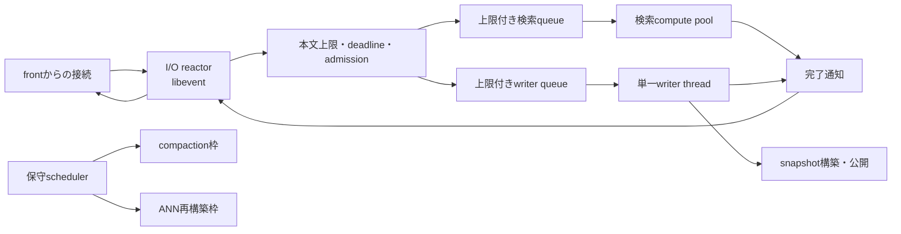
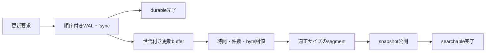

# 単一端末runtimeの並列実行設計

この文書は、Yappod2が一台の端末にあるCPU、メモリー、ディスクI/O、ネットワークI/Oを効率よく
利用するための実行構成を定めます。複数端末へ水平シャードを配置する前に、単一の`yappod_core`
プロセス内でI/O待ちと検索計算を分離し、更新と保守処理が検索を不必要に停止させない状態を作ります。

複数端末の最終構成は[クラスタ構成計画](cluster-architecture-plan.md)、現在の公開設定は
[設定リファレンス](configuration.md)、更新とセグメントの現在の契約は
[索引の更新と保守](index-lifecycle.md)を参照してください。

## 結論

単一端末で一つの論理シャードを動かす既定構成は、**一つのcoreプロセスと複数スレッド**です。
Cのpthreadは複数のCPUコアで同時に実行できるため、CPU使用率を上げる目的だけで同じ索引を開くcore
プロセスを増やしません。同じ索引を複数プロセスへ複製すると、文書、可視性表、検索component、ANNの
メモリーを重複して保持し、同じディスクとページキャッシュを競合させるためです。

複数coreプロセスは、次のいずれかが必要になった後で使います。

- 文書を水平シャードへ分け、各プロセスが異なる文書集合を所有します。
- 一つのプロセス障害から検索を継続するため、異なる障害ドメインへレプリカを配置します。
- 端末のNUMA境界または独立したストレージ装置へ、異なるシャードを固定する必要があります。

同じ端末内の同じ索引を複数coreへ読み込ませる構成は、単一端末の性能改善手段として採用しません。

## 実装状態

| 項目 | 状態 |
|---|---|
| front接続I/O、core接続I/O、core検索computeの設定分離 | 実装済みです。 |
| 容量固定の検索executorと単一writer executor | 実装済みです。 |
| libeventによる非blocking接続 | 実装済みです。1本のacceptorが複数reactorへ接続を分配し、executor完了はmailboxで元のreactorへ戻します。 |
| front/core間のpersistent connection | 未実装です。現在は1接続1要求で応答後に閉じます。 |
| 検索要求単位のsnapshot参照保持と短時間の公開交換 | 実装済みです。変更のないsegment資源も新旧世代で共有します。 |
| 負荷budget付きmaintenance scheduler | 未実装です。 |
| WAL、更新buffer、refresh、tiered merge | 未実装です。 |

正式な現在動作は[アーキテクチャ](architecture.md)と[設定リファレンス](configuration.md)を優先します。
この表は各実装段階の完了時に更新します。

## 現在の実装

現在の`yappod_core`は、一つのacceptorが接続を`core_io_threads`個のlibevent reactorへ分配します。
reactorはHTTPを増分解析し、検索は`core_search_threads`個のcompute worker、更新は単一writer threadへ
渡します。処理完了はmailboxで接続元のreactorへ戻すため、reactorは検索、更新、部分的な要求本文を
待って停止しません。内部HTTPは現在1要求ごとに`Connection: close`を使います。

検索componentのうち語彙索引とベクトルは`mmap`で開きます。通常検索の読み出しはOSのページ
キャッシュを通りますが、未常駐ページのpage faultは検索を実行しているworkerを停止させます。
更新、manifest公開、component公開は耐久性境界で`fsync`を同期実行します。

検索要求は開始時に不変runtimeへの参照を取得し、応答を構築した後で解放します。更新後の候補runtimeは
検索と並行して構築し、変更のない語彙、ベクトル、segment ANN、メタデータ、文書snapshotを旧runtimeと
共有します。新しい世代の公開時に保持するmutexは現在runtimeへのポインタ交換だけです。旧runtimeと
旧世代だけの資源は、それを使用している検索がすべて終了してから解放します。

コンパクションとANN保守には独立スレッドがありますが、検索と同じディスク、CPU、メモリー帯域を使う
負荷の調整機構はありません。

## 目標構成

I/O reactor、検索compute pool、writer、保守schedulerは同じcoreプロセス内で動きます。共有する
snapshotは不変とし、検索要求は開始時に一つのsnapshot参照を取得し、応答構築後に解放します。

## ネットワークI/O

frontとcoreのソケットはlibeventで扱います。libeventはmacOSでは`kqueue`、Linuxでは`epoll`を
利用できるため、プラットフォーム固有APIをアプリケーション本体へ直接埋め込みません。

I/O reactorの責務は次に限定します。

- 接続受付、keep-alive、部分的なheaderと本文の読み書き
- 本文、header、接続数、未送信応答byte数の上限検査
- 絶対deadline、切断、キャンセルの検出
- 完成した要求の上限付きqueueへの投入と、完了した応答の送信

I/O callbackではJSON解析、索引検索、埋め込みAPI呼び出し、`fsync`、コンパクションを実行しません。
検索queueが満杯なら待ち続けず`503 overloaded`を返します。クライアントが切断した要求は、計算開始前
ならqueueから破棄し、計算開始後は結果を送信せず参照だけを安全に解放します。

接続ごとの入力bufferと出力bufferにはhigh watermarkを設け、上限に達した接続の読み込みを止めます。
compute threadからsocketやevent loopを直接操作せず、完了queueと通知用descriptorを通して応答をreactorへ
戻します。一つのevent baseを同時に複数スレッドからdispatchしません。単一reactorが測定上の上限になった
場合は、listen socketを共有する複数event baseへ分割します。

## 検索計算

検索compute poolはCPU負荷の高いJSON解析後の検索、候補統合、snippet、応答JSON生成を担当します。
同時実行数はI/O接続数と分離します。CPU workerの推奨初期値は利用可能な論理CPU数以下とし、実データで
RPSとP99が改善しなくなる点を上限にします。workerを増やしてRSS、page fault、context switchだけが
増える構成は採用しません。

一つの検索が全workerを内側から追加並列化する設計にはしません。最初は要求間並列でCPUを利用し、ANNや
多数セグメントの一検索内並列化は、要求並列数が低い場合にもCPUが余ることを計測した後で追加します。

最初のcompute queueは、容量を固定した共有queueとします。workerごとのlock-free queueやwork stealingは、
共有queueのmutex待ちがCPU時間の有意な割合を占めることを計測した場合だけ導入します。導入する場合も、
各workerは原則としてローカルqueueを処理し、空になったworkerの一部だけが別queueからまとめて取得する
方式とし、全workerが常にstealを試す競合を避けます。

## 通常検索のファイルI/O

通常検索では、各postingまたはベクトルを明示的な非同期readへ置き換えません。不変componentを`mmap`
し、OSのページキャッシュとreadaheadを使います。regular fileはソケットのようにreadiness通知できず、
macOSにはLinuxの`io_uring`と同じ契約もないためです。

新しいsnapshotは検索へ公開する前に、次の順序で準備します。

1. manifestを検証し、旧世代とdescriptorが一致するcomponentは参照を共有し、追加または変更された
   componentだけを検証してmapします。
2. 追加された語彙辞書、posting、ベクトル、可視性表について、設定した予熱量の`madvise`または同等の
   OS hintを発行します。
3. 最低限の構造検証と代表アクセスを終えます。
4. 現在snapshotへのポインタを短時間の排他区間で交換します。
5. 古いsnapshotは、参照中の検索がすべて解放した後で閉じます。

予熱byte数は上限を持ちます。索引全体を毎世代読み直してI/Oを使い切ることはせず、新規または変更された
componentだけを対象にします。cold cache性能とwarm cache性能は負荷試験で分けて記録します。

## 更新I/Oと高頻度更新

更新要求は一つの上限付きwriter queueへ入れ、単一writer threadが世代順に処理します。manifestの公開順序、
文書IDの最新版、削除、耐久性を壊さないため、同じシャードに複数のmanifest writerを置きません。

`fsync`はdurable応答の境界なので、単に非同期化して応答を先に返しません。I/O reactorからは切り離し、
writer threadがWALと公開対象を同期した後で完了を通知します。公開APIでは将来、次の二つを区別します。

- durable: 更新がWALへ永続化され、再起動後に再適用できます。
- searchable: 指定した更新が含まれるsnapshotへ切り替わり、検索できます。

高頻度更新では、API要求ごとに物理セグメントとmanifest世代を一つ作る方式を最終形にしません。writerは
複数のdurable更新をメモリー上の世代付きbufferへ集約し、経過時間、operation数、推定component byte数の
いずれかが閾値へ達した時点でrefreshします。一回のrefreshは複数の更新transactionを含められます。

bufferが上限へ達してもflushできない場合は更新を無制限に受理せず、backpressureを返します。WAL、buffer、
refresh、segment作成、manifest公開の再起動回復規則を実装するまでは、現在の「一更新batchにつき一世代」
という公開契約を維持します。

flush後のセグメントはbyte数によるtierへ分類します。各tierには許容セグメント数を設け、超過時はサイズの
近いセグメントから、出力サイズ、削除回収量、世代の局所性、書き込み増幅を使ってmerge候補を評価します。
小セグメントだけを一定個数ずつまとめ続ける方式にはしません。また、最大サイズのセグメントを一つ作る
ことも目標にせず、検索workerが分担できる目標セグメント数と一セグメントの上限を両方持ちます。

## コンパクションとANN保守

コンパクションとANN再構築はmaintenance schedulerへ集約します。検索compute queueが混雑している間は新しい
保守処理を開始せず、開始済み処理も同時数、読み込みbyte/s、書き込みbyte/sのbudgetを守ります。

初期値では、同じシャードの重い書き込み保守処理は一つだけ実行します。コンパクションとANN再構築を同時に
走らせ、SSD帯域とページキャッシュを互いに追い出す構成にしません。小セグメント数だけでなく、検索時に
調べるdelta数、compaction backlog、WAL量、refresh待ち時間を開始条件へ使います。

## queueと負荷制御

少なくとも次の枠を独立させます。

| 枠 | 制限対象 | 満杯時の動作 |
|---|---|---|
| 接続 | open socket数、header byte、未読本文byte、未送信応答byte | 新規受付を抑制するか`503`を返します。 |
| 検索queue | 待機件数、要求byte、推定応答byte | `503 overloaded`を返します。 |
| 検索compute | 同時検索数 | queue上限まで待機し、それ以上は受理しません。 |
| writer queue | 更新件数、operation数、本文byte、WAL未反映byte | `503 overloaded`を返します。 |
| maintenance | 同時job数、読み書きbyte/s | 新規jobを延期します。 |

frontが受理する公開要求数とcoreが実行する検索数も別の値にします。`front_io_threads`、
`core_io_threads`、`core_search_threads`を独立して設定します。

## snapshotの排他と世代

検索は開始時に現在snapshotをretainし、検索終了時にreleaseします。runtime全体のread lockを検索終了まで
保持しません。更新側は候補snapshotを検索と並行して構築し、公開時だけ短時間のmutexで現在ポインタを
交換します。これにより、古い世代を使用中の検索を中断せず、新しい検索だけを新世代へ進めます。

同じ要求内では一つのsnapshotだけを使います。検索途中に新世代が公開されても、文書可視性、BM25F統計、
ANN基底、更新差分、cursor世代を混ぜません。

## 正常終了

停止時は次の順序を守ります。

1. 新しい接続の受付を止めます。
2. 新しい検索と更新をqueueへ入れません。
3. deadline内の検索応答を送信します。
4. writer queueのdurable境界まで処理し、未公開bufferはWALから回復可能な状態にします。
5. maintenanceへキャンセル可能な停止を通知します。
6. reactor、compute worker、writer、maintenanceの順にjoinします。
7. 最後のsnapshot参照を解放し、PIDファイルを回収します。

強制終了後も、公開済みmanifestと同期済みWALだけから回復できなければなりません。

## 計測と水平シャードへ進む条件

単一端末試験では、client並列数、I/O接続数、検索worker数、検索queue上限を組み合わせ、RPS、成功率、P50、
P95、P99、CPU user/system、RSS、major/minor page fault、context switch、ディスクread/write byte、IOPS、
queue待ち時間、`503`数を記録します。warm cache、cold cache、検索のみ、更新併走、compaction併走を分けます。

次のいずれかが継続する場合は、同じ索引の複製ではなく水平シャードへ進みます。

- 検索workerを適正値まで増やしても、一つのcoreがCPU、メモリー帯域、SSD帯域の上限です。
- snapshotのRSS、起動時間、予熱時間、可視性表が一台の安全域を超えます。
- compaction、ANN再構築、WAL回復が運用時間内に終わりません。
- 更新と検索のSLOを、保守budgetを含めて同じ端末で満たせません。

## 実装順序と完了条件

1. front/coreのI/O枠とcoreの検索compute枠を独立した設定にします。実装済みです。
2. coreへ上限付き検索queueとcompute poolを追加し、接続処理から検索計算を分離します。実装済みです。
3. libeventによる非同期接続、endpoint別deadline、完了通知へ移行します。実装済みです。
4. 更新をwriter queueへ移し、件数と本文合計byteで検索queueとは独立に負荷制御します。実装済みです。
5. front/core間のpersistent connectionを追加し、接続確立コストを測定します。
6. snapshotを要求単位の参照保持と短時間のポインタ交換へ変更します。実装済みです。
7. compactionとANNを負荷budget付きmaintenance schedulerへ統合します。
8. WAL、更新buffer、refresh条件、durable/searchable待機を実装します。
9. 単一端末の負荷試験で適正値と水平シャード移行条件を確定します。

各段階で旧CLI、旧TOML、旧内部通信、旧索引形式との後方互換分岐は追加しません。契約を変更する場合は
現在の正式文書、設定例、実装、受け入れテストを同じ変更で置き換えます。途中段階を最終構成として記載せず、
実装済みの機能と未実装の設計を設定リファレンスで区別します。

## 設計判断に使用した一次資料

- [Libevent 2.2.2公式文書](https://libevent.org/doc/)は、event baseを一つのスレッドがdispatchする構成、
  複数event base、buffered I/O、macOSの`kqueue`とLinuxの`epoll`を含むbackendを説明しています。
- [Libevent bufferevent公式文書](https://libevent.org/libevent-book/Ref6_bufferevent.html)は、非blocking
  socket、deferred callback、thread-safe option、read/write watermarkの契約を説明しています。
- [Lucene 10.3.1 `ControlledRealTimeReopenThread`](https://lucene.apache.org/core/10_3_1/core/org/apache/lucene/search/ControlledRealTimeReopenThread.html)
  は、更新世代と検索可能世代を分け、background refreshと特定世代の待機を行うNRTモデルを示しています。
- [Lucene 10.4.0 `TieredMergePolicy`](https://lucene.apache.org/core/10_4_0/core/org/apache/lucene/index/TieredMergePolicy.html)
  は、tierごとのセグメント予算、サイズの偏り、削除回収、最大mergeサイズ、検索並列度と書き込み増幅の
  trade-offを説明しています。
- [RocksDBのWAL形式](https://github.com/facebook/rocksdb/wiki/Write-Ahead-Log-File-Format)と
  [Write Stalls](https://github.com/facebook/rocksdb/wiki/Write-Stalls)は、WALからのbuffer回復、複数更新の
  batch、flushまたはcompaction遅延時のbackpressureを説明しています。
- [Linux kernelの`io_uring`文書](https://docs.kernel.org/)はLinux固有の高速経路を評価する際の一次資料と
  します。ただし、macOSを含む基本契約にはせず、同じ負荷でlibeventと`mmap`を上回ることを確認してから
  任意backendとして追加します。
