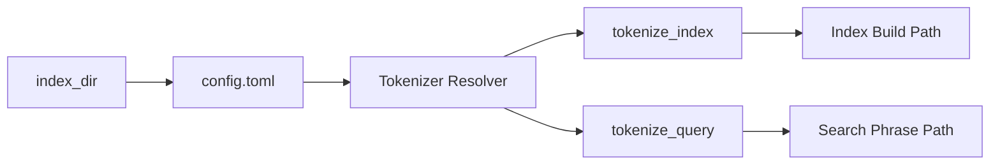

# トークナイザ差し替え基盤 設計書（Task 5: 設計のみ）

## 1. 背景と現状整理

現状の Yappod2 では、索引作成/検索のトークナイズ処理が `src/yappo_ngram.c` に直接結合しています。

### 現在の呼び出し経路

- 索引作成経路
  - `src/yappo_makeindex.c`
  - `YAP_Ngram_tokenize(body, &keyword_num)` を直接呼び出す
  - `add_keyword_dict()` で `NGRAM_LIST` を直接処理する
- 検索経路
  - `src/yappo_search.c`
  - `YAP_Ngram_tokenize_search(keyword, &ngram_list_len)` を直接呼び出す
  - `YAP_Search_phrase()` で `NGRAM_SEARCH_LIST` を直接処理する

### 現行トークナイズ規則（UTF-8 専用）

`src/yappo_ngram.c` の実装上、現在は以下の規則です。

- 非 ASCII（UTF-8 マルチバイト）: 2 コードポイントのバイグラム
- ASCII 英数字（`isalnum`）: 連続列を 1 トークンとして小文字化
- 記号/制御文字: 既存互換としてスキップ
- 位置 `pos` の扱い:
  - 非 ASCII 側: 1 コードポイント進むごとに `+1`
  - ASCII 連続列: 文字列長（バイト長）分を加算

この「混在する `pos` モデル」を将来維持するか再定義するかを、抽象化後に明示できる形へ整理します。

## 2. 目標と非目標

### 目標

- トークナイザの抽象化境界（API）を定義し、将来差し替え可能にする。
- トークナイザ選択をインデックス単位の設定で明示化する。
- 設定異常時は fail-fast で即時失敗する契約を定義する。
- 実装者が追加意思決定なしで着手できる設計仕様を完成させる。

### 非目標（本タスク）

- `src/` の実装変更は行わない。
- 既存インデックス形式との互換は保証しない（非互換許容）。
- CLI オプション（`--tokenizer` 等）の追加は行わない。
- TOML パーサの実装方式（外部ライブラリ/自前）確定は行わない。

## 3. 公開インターフェース案（将来実装対象）

### 3.1 新規追加予定ファイル

- `src/yappo_tokenizer.h`
- `src/yappo_tokenizer_legacy.c`
- （必要に応じて）`src/yappo_tokenizer_config.c`

### 3.2 想定型定義

```c
/* bytes は UTF-8 の生バイト列を保持する */
typedef struct {
  unsigned char *bytes;
  size_t len;
  int pos;
} YAP_TOKEN;

typedef struct {
  YAP_TOKEN *items;
  int count;
} YAP_TOKEN_SEQ;

typedef struct {
  const char *name;
  int (*tokenize_index)(const char *text, YAP_TOKEN_SEQ *out);
  int (*tokenize_query)(const char *text, YAP_TOKEN_SEQ *out);
  void (*free_seq)(YAP_TOKEN_SEQ *seq);
} YAP_TOKENIZER_VTABLE;
```

### 3.3 呼び出し契約（所有権）

- `tokenize_index` / `tokenize_query`
  - `out->items` および各 `bytes` を確保して返す
  - 成功時 `0`、失敗時 非 `0` を返す
- 呼び出し側が `YAP_TOKEN_SEQ` を所有し、`free_seq` を必ず呼ぶ
- `free_seq` は NULL-safe かつ多重呼び出しで破綻しないこと

### 3.4 位置 `pos` 契約

`legacy_bigram_ascii` 実装（将来の初期実装）は、現行 `yappo_ngram` と同等の `pos` 意味論を保持します。

- ASCII 英数字連結トークン: `pos += run_length`
- 非 ASCII: ステップごとに `pos += 1`
- 記号スキップ時の走査進行も現行に合わせる

### 3.5 互換ブリッジ方針

移行期は `YAP_Ngram_*` を互換ラッパとして段階運用し、最終的に整理します。

- Stage 1: `YAP_Ngram_*` から tokenizer 抽象へ委譲
- Stage 2: 呼び出し側を tokenizer 抽象へ直接移行
- Stage 3: ラッパ廃止（テスト同等性確認後）

## 4. 設定仕様

トークナイザ選択はインデックスディレクトリ配下の設定ファイルで管理します。

- 設定ファイル: `<index_dir>/config.toml`
- スキーマ:

```toml
[tokenizer]
name = "legacy_bigram_ascii"
```

### 検証ルール

- `config.toml` が存在しない: fatal
- `[tokenizer]` テーブルが無い: fatal
- `name` が無い: fatal
- 未知の tokenizer 名: fatal
- TOML 構文不正: fatal

### エラー契約

設定異常時は必ず以下を満たします。

- stderr に「対象ファイルパス + 理由」を明示出力
- エントリポイントは非 0 で終了（fail-fast）

## 5. データフローとエラー処理（将来実装時）

### 5.1 索引作成（`yappo_makeindex`）

1. `<index_dir>/config.toml` を読込
2. `name` から tokenizer を解決
3. `tokenize_index(body)` を実行
4. `YAP_TOKEN_SEQ` から postings/辞書更新へ変換
5. トークン列を解放

失敗時:

- 設定読込/解析失敗: 即時失敗
- tokenizer 解決失敗: 即時失敗
- tokenization 失敗: 行コンテキスト付きで失敗

### 5.2 検索（`search`, `yappod_core`）

1. 同じ `<index_dir>/config.toml` を読込
2. tokenizer を解決
3. `tokenize_query(keyword)` を実行
4. 返却トークン列 + `pos` でフレーズ検索マージ
5. トークン列を解放

失敗時:

- 設定不正/不整合: 即時失敗
- tokenization 失敗: 検索失敗として明示ログ

### 5.3 フロー図



## 6. 移行戦略

本設計の方針は「非互換許容 + 再インデックス必須」です。

- 旧形式/新形式の同時読込対応は行わない
- tokenizer 仕様変更時は必ず再インデックス
- 運用手順に再構築ステップを明記する

移行手順:

1. tokenizer 抽象対応バイナリを配布
2. `<index_dir>/config.toml` を配置/更新
3. `yappo_makeindex` で再インデックス
4. `yappod_core` / `yappod_front` を再起動

## 7. 実装フェーズ分割（小PR単位）

### PR-1: API スケルトン

- `yappo_tokenizer.h` 追加
- `yappo_tokenizer_legacy.c` スケルトン追加
- 挙動変更なし

### PR-2: 索引経路切替

- `yappo_makeindex.c` を `YAP_Ngram_tokenize` 直依存から tokenizer API へ切替
- `legacy_bigram_ascii` で出力同等性を維持

### PR-3: 検索経路切替

- `yappo_search.c` を `YAP_Ngram_tokenize_search` 直依存から tokenizer API へ切替
- フレーズ検索の `pos` 意味論を維持

### PR-4: 設定読込 + fail-fast

- `<index_dir>/config.toml` 読込
- tokenizer 名解決と厳格バリデーション導入

### PR-5: 互換整理

- `YAP_Ngram_*` をラッパ経由へ集約、段階廃止準備
- include/callsite 整理

### PR-6: テスト拡張

- tokenizer 同等性テスト
- 設定異常系テスト
- `pos` 回帰テスト

## 8. テスト計画（実装フェーズで追加）

### 正常系

- `legacy_bigram_ascii` が現行同等のトークン列/`pos` を返す
- 既存 fixture で index + search の E2E が通る

### 異常系

- `config.toml` 欠落
- `[tokenizer]` 欠落
- `name` 欠落
- 未知 `name`
- TOML 構文不正

### 機能回帰

- フレーズ検索の位置差分判定が破綻しない
- ASCII 連結トークン化と小文字化が維持される
- 非ASCIIバイグラム分割が維持される

### 運用

- tokenizer 契約が異なるインデックスを使用した際に fail-fast する

## 9. 受け入れ基準

本タスク（設計のみ）の完了条件:

- 実装者が追加の意思決定なしで着手できる
- API契約、設定契約、失敗モード、移行手順、テスト観点が明文化されている
- 「再インデックス前提」「非互換許容」「`config.toml` 採用」が明示されている

## 10. 前提・デフォルト

- 本タスクは設計書作成のみ（コード実装変更なし）
- トークナイザ選択は CLI ではなく設定ファイル方式
- 設定ファイル名は `config.toml` 固定
- TOML の具体パーサ実装方式は実装タスクで決定
