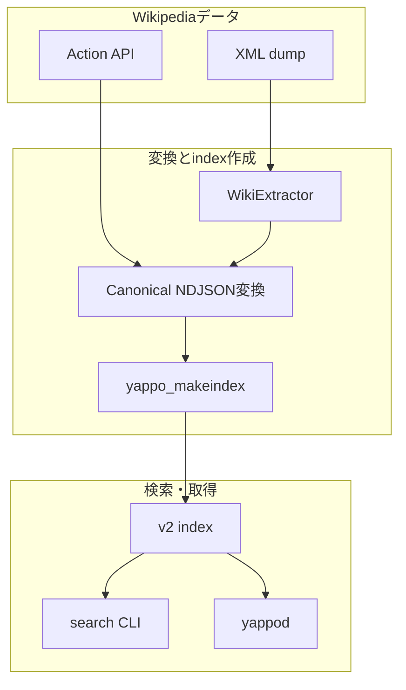
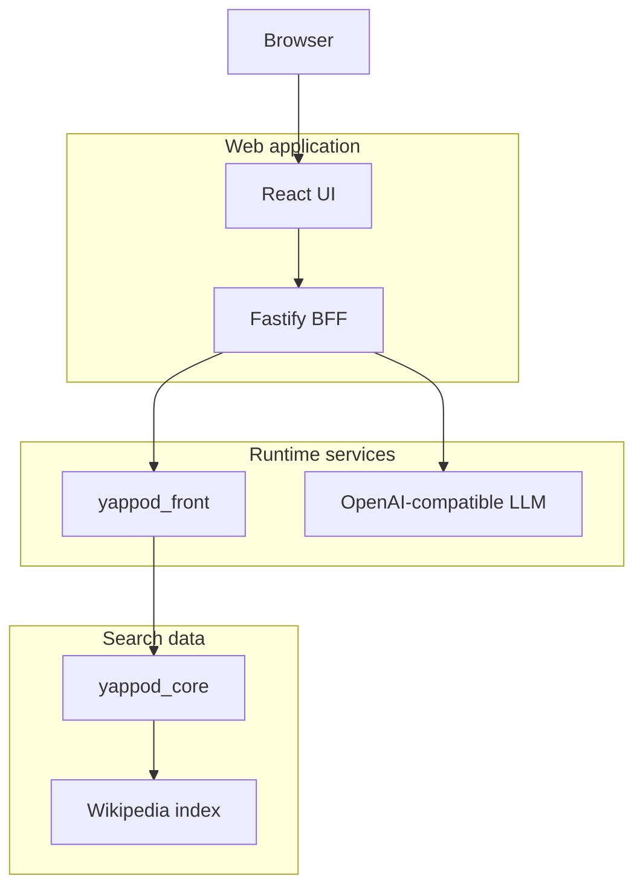

# 日本語 Wikipedia 検索サンプル

日本語 Wikipedia の記事を yappod2 の canonical NDJSON に変換し、lexical index、HTTP検索、
RAG向けpassage取得まで確認するローカル実行用サンプルです。

すぐに試す場合はWikimedia Action APIから既定1,000記事の冒頭を取得します。全記事を対象にする
場合は公式XML dumpをダウンロードし、WikiExtractorで平文へ変換します。どちらも最終的には
同じNDJSON schemaと`config.toml`を使用します。

## 構成



このサンプルのindexはvectorを無効にしています。RAGの確認はlexical retrievalで行います。
回答生成はyappodの責務ではなく、後続のWeb UIサンプルで接続します。

## 必要環境

- yappod2本体のビルドに必要な依存関係
- Python 3.9以上
- Web UIを使う場合はNode.js 22以上とnpm
- `curl`（daemonのhealth checkとHTTP smokeに使用）
- 全量dumpを使う場合だけWikiExtractor 3.0.7

リポジトリルートで本体をビルドしてください。

```sh
cmake -S . -B build -DCMAKE_BUILD_TYPE=Release
cmake --build build -j
```

## 小規模データを取得する

以下は日本の歴史、自然科学、情報技術、芸術など20トピックを順に検索し、重複を除いた記事の
冒頭を最大1,000件保存します。API requestは逐次実行し、Wikimediaの要求に従った識別可能な
User-Agentを送信します。

```sh
cd examples/wikipedia-search
python3 wikipedia_data.py fetch-api \
  --limit 1000 \
  --output data/documents.ndjson
```

対象を絞る場合は`--topic`を複数指定できます。

```sh
python3 wikipedia_data.py fetch-api \
  --topic 検索エンジン \
  --topic 自然言語処理 \
  --limit 100 \
  --output data/search-documents.ndjson
```

組織や個人の連絡先を含むUser-Agentへ変更する場合は`WIKIMEDIA_USER_AGENT`を設定してください。

## 全量dumpを変換する

日本語Wikipediaの全量XMLは数GBあります。`latest`の実サイズは更新ごとに変わるため、開始前に
[公式directory index](https://dumps.wikimedia.org/jawiki/latest/)で確認してください。展開結果と
indexには圧縮ファイルより大きな空き容量が必要です。

まずdumpと公式SHA-1 checksumを取得します。中断後に同じコマンドを実行すると`.part`から再開します。

```sh
python3 wikipedia_data.py download-dump --output-dir data/dump
```

専用virtual environmentへ固定versionのWikiExtractorを導入し、JSON linesへ平文化します。

```sh
python3 -m venv .venv
.venv/bin/python -m pip install 'wikiextractor==3.0.7'
.venv/bin/python -m wikiextractor.WikiExtractor \
  data/dump/jawiki-latest-pages-articles-multistream.xml.bz2 \
  --json \
  --processes 4 \
  --output data/extracted
```

WikiExtractor出力をcanonical NDJSONへ変換します。動作確認だけなら`--limit 10000`のように
上限を指定できます。全量変換では`--limit`を省略します。

```sh
python3 wikipedia_data.py convert-dump \
  --input data/extracted \
  --output data/documents.ndjson
```

## Indexを作成して検索する

`build`は既存indexを上書きしません。作り直す場合は、必要なindexでないことを確認してから利用者が
明示的に古いdirectoryを削除してください。

```sh
./scripts/build_index.sh data/documents.ndjson ./index

../../build/search \
  --index ./index \
  --mode lexical \
  --query 日本の歴史
```

別の場所へindexを作る場合は第2引数で指定します。

## HTTP検索とRAG用passage取得

daemonは`run/`にPIDとlogを保存します。標準portはfrontが`10080`、coreが`10086`です。

```sh
./scripts/start_daemons.sh ./index
./scripts/smoke.sh 日本
```

個別に確認する場合は次のrequestを使用します。

```sh
curl -sS -H 'Content-Type: application/json' \
  --data '{"query":"日本","mode":"lexical","scope":"documents","limit":5}' \
  http://127.0.0.1:10080/v2/search

curl -sS -H 'Content-Type: application/json' \
  --data '{"query":"日本","mode":"lexical","limit":5,"max_passages_per_document":2,"max_context_bytes":16384}' \
  http://127.0.0.1:10080/v2/retrieve
```

`/v2/retrieve`は`context`と、記事URL・title・本文offset・scoreを持つ`citations`を返します。
確認後はdaemonを停止します。

```sh
./scripts/stop_daemons.sh
```

portを変更する場合は、起動・smoke・停止で同じ環境変数を使用してください。

```sh
YAPPOD_CORE_PORT=11086 YAPPOD_FRONT_PORT=11080 ./scripts/start_daemons.sh ./index
YAPPOD_FRONT_PORT=11080 ./scripts/smoke.sh 日本
./scripts/stop_daemons.sh
```

## Web UI

Web UIはTypeScript、Fastify BFF、React/Viteで構成されています。BrowserはyappodやLLMへ直接接続せず、
検索、readiness確認、文書登録、引用付きRAGをBFF経由で行います。daemonの接続先、write token、
LLM API keyはBFF processだけが保持し、Browserへ返すHTMLやJSONには含めません。



図はBrowser、Web application、Runtime services、Search dataの4段に分け、各段を2要素以内にしています。
検索の主経路とLLMへの分岐だけを示し、横長・縦長のどちらにも偏らない構成です。

### 一括起動

index、core、front、production BFF/UIをまとめて起動できます。最初にWeb依存関係を導入してください。

```sh
cd examples/wikipedia-search/web
npm install

cd ..
export YAPPOD_WRITE_TOKEN='replace-with-16-or-more-characters'
./scripts/start_demo.sh data/documents.ndjson ./index
```

第1引数はcanonical NDJSON、第2引数はindex directoryです。第2引数に有効なindexがある場合はそのまま
利用します。indexが存在しない場合だけ第1引数から新規作成し、既存directoryは上書きしません。
起動時にWeb UIをproduction buildし、標準では`http://127.0.0.1:4173`で配信します。

RAGの一巡だけを外部LLMなしで確認する場合は、loopbackだけで待ち受ける決定的なmockを有効にします。
このmockは接続確認用であり、質問内容に応じた回答品質を評価するものではありません。

```sh
YAPPOD_DEMO_MOCK_LLM=1 \
  ./scripts/start_demo.sh data/documents.ndjson ./index
```

実LLMを利用する場合は`YAPPOD_DEMO_MOCK_LLM`を指定せず、後述の`LLM_BASE_URL`と`LLM_MODEL`を
設定して起動します。確認後はWeb、mock LLM、front、coreをまとめて停止します。

```sh
./scripts/stop_demo.sh
```

PIDとlogは標準で`run/`に保存します。起動失敗時は起動済みprocessを自動停止します。問題が残る場合は
`run/*.error`と`run/*.log`を確認してから`stop_demo.sh`を再実行してください。processが動作中のまま
PID fileだけを削除しないでください。停止は最初にSIGTERMを送り、5秒以内に終了しないprocessだけを
SIGKILLへ切り替えます。

| 一括起動用環境変数 | 既定値 | 用途 |
|---|---|---|
| `YAPPOD_RUN_DIR` | `./run` | PIDとlogの保存先 |
| `YAPPOD_CORE_PORT` | `10086` | coreの内部port |
| `YAPPOD_FRONT_PORT` | `10080` | frontのHTTP port |
| `YAPPOD_WEB_HOST` | `127.0.0.1` | production BFF/UIのlisten address |
| `YAPPOD_WEB_PORT` | `4173` | production BFF/UIのport |
| `YAPPOD_DEMO_MOCK_LLM` | `0` | `1`の場合だけlocal mock LLMを起動 |
| `YAPPOD_MOCK_LLM_HOST` | `127.0.0.1` | mock LLMのlisten address。loopbackのみ許可 |
| `YAPPOD_MOCK_LLM_PORT` | `1234` | mock LLMのport |

### 開発起動

最初に依存関係を導入します。

```sh
cd examples/wikipedia-search/web
npm install
```

文書登録を利用する場合は16文字以上のtokenを設定し、同じ値をdaemonとBFFへ渡します。検索だけを
確認する場合はtokenを省略できます。

```sh
cd examples/wikipedia-search
export YAPPOD_WRITE_TOKEN='replace-with-16-or-more-characters'
YAPPOD_V2_WRITE_TOKEN="$YAPPOD_WRITE_TOKEN" ./scripts/start_daemons.sh ./index

cd web
npm run dev
```

Browserで`http://127.0.0.1:5173`を開きます。Viteは`/api`だけを`127.0.0.1:4173`のBFFへ転送します。

### 引用付きRAG

質問画面は`/v2/retrieve`からlexical passageを取得し、設定済みの場合だけOpenAI-compatibleな
`POST /chat/completions`へ送ります。modelは固定せず、利用するserverで有効なmodel IDを環境変数へ
指定します。

```sh
export LLM_BASE_URL='http://127.0.0.1:1234/v1'
export LLM_MODEL='local-model-name'
# 認証が必要なserverの場合だけ設定
export LLM_API_KEY='replace-with-server-api-key'

cd examples/wikipedia-search/web
npm run dev
```

LLMを設定しない場合も質問画面は利用でき、取得contextと参照資料を表示します。LLM失敗時も同様に
参照資料を残します。生成回答はplain textとして扱い、`[1]`形式の参照番号が取得済みcitationの範囲内に
あり、少なくとも1件使われている場合だけ表示します。範囲外参照や参照なしの回答は採用しません。

BFFはChat Completionsの`messages` requestと`choices[0].message.content` responseを使用します。
OpenAI APIへ接続する場合の正式仕様は
[Chat Completions API reference](https://platform.openai.com/docs/api-reference/chat/create)を確認してください。
互換serverについては各serverの対応parameterと認証方法を確認してください。

### production build

```sh
cd examples/wikipedia-search/web
npm run build
npm start
```

productionではFastifyがbuild済みUIも配信します。標準URLは`http://127.0.0.1:4173`です。

| 環境変数 | 既定値 | 用途 |
|---|---|---|
| `YAPPOD_URL` | `http://127.0.0.1:10080` | BFFから接続するfront URL |
| `YAPPOD_WRITE_TOKEN` | 未設定 | 文書登録時だけBFFがBearer headerへ設定 |
| `YAPPOD_TIMEOUT_MS` | `5000` | BFFからdaemonへのtimeout |
| `LLM_BASE_URL` | 未設定 | OpenAI-compatible APIの`/v1`等を含むbase URL |
| `LLM_MODEL` | 未設定 | Chat Completionsへ渡すmodel ID |
| `LLM_API_KEY` | 未設定 | 必要な場合だけBFFがLLMのBearer headerへ設定 |
| `LLM_TIMEOUT_MS` | `30000` | BFFからLLMへのtimeout |
| `HOST` | `127.0.0.1` | BFFのlisten address |
| `PORT` | `4173` | BFFのlisten port |

画面を実装する前に定義した主要タスク、状態、低精度wireframe、heuristic reviewは
[UX設計](docs/ux-design.md)を参照してください。

### Web UIのテスト

```sh
cd examples/wikipedia-search/web
npm run typecheck
npm test
npm run build
npm run test:e2e
```

`test:e2e`はfixtureから一時indexを作り、core、front、mock LLM、production BFF/UIを起動します。
初期検索、BFF経由の単一文書登録、登録後の再検索、`/v2/retrieve`、`[1]`付きmock回答、全process停止を
検証します。外部networkや実LLM API keyは使用しません。

## テスト

fixtureを使うため、通常テストはWikimediaへ接続しません。

```sh
python3 -m unittest discover -s tests -p 'test_*.py'
ctest --test-dir ../../build --output-on-failure
```

## データ利用時の注意

Wikipedia本文はCC BY-SA等の条件で提供されています。再配布や公開サービスへの利用時は、記事ごとの
原URLを保持し、Wikipedia contributorsへの帰属、適用ライセンス、変更の有無を利用形態に応じて
表示してください。このサンプルは原記事URLをcanonical documentへ保存します。

- [Wikimedia dump](https://dumps.wikimedia.org/jawiki/latest/)
- [MediaWiki Search API](https://www.mediawiki.org/wiki/API%3ASearch/ja)
- [TextExtracts](https://www.mediawiki.org/wiki/Extension%3ATextExtracts)
- [Wikimedia API Usage Guidelines](https://foundation.wikimedia.org/wiki/Policy%3AWikimedia_Foundation_API_Usage_Guidelines)
- [Wikimedia User-Agent Policy](https://foundation.wikimedia.org/wiki/Policy:Wikimedia_Foundation_User-Agent_Policy)
- [WikiExtractor](https://github.com/attardi/wikiextractor)

APIから大量取得するときはWikimediaのrate limit指示に従ってください。制限を別User-Agentや並列接続で
回避してはいけません。
