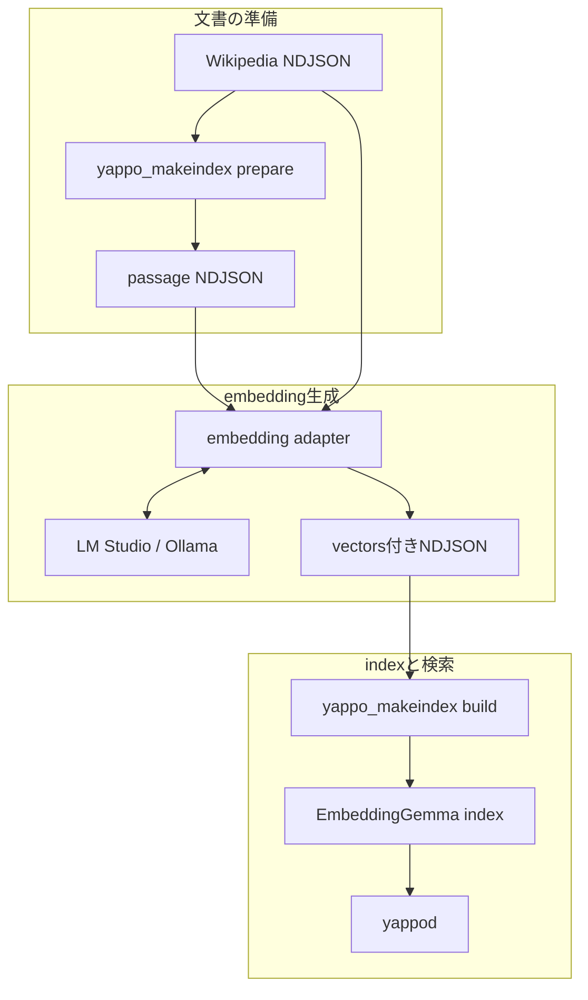

# 1,000記事をvector対応にする

この文書は、`wikipedia_data.py fetch-api`で取得した最大1,000件の記事をGoogleのEmbeddingGemmaで
vector化し、yappod2のvector検索とhybrid検索を確認するための手順です。embeddingの実行には、
ローカルで動くLM StudioまたはOllamaを使用します。外部の有料APIは必要ありません。

この手順は日本語Wikipedia全量dumpを対象にしていません。全量処理にはstreaming ingest、
中断再開、segment分割、メモリ使用量の改善が必要です。

## 役割分担

yappod2は生成済みvectorを保存し、USearchによるHNSW検索とBM25Fとのhybrid検索を行います。
文章からvectorを生成する処理はLM StudioまたはOllamaが担当します。SQLiteのvector拡張と同様に、
vector検索とembedding生成は別の処理です。



3段それぞれを3要素以内にし、元文書とpassageの合流だけを中央段で表しています。

## 前提と固定する値

- embeddingモデル: Google EmbeddingGemma 300M
- dense vectorの次元数: 768
- 距離関数: cosine
- 文書側とquery側で同じモデルvariantを使用する
- yappod2のchunk設定: 800文字、120文字overlap
- LM StudioまたはOllamaはloopback addressだけで待ち受ける

EmbeddingGemmaは100以上の言語を対象とする308M parameterのモデルで、既定出力は768次元です。
Google公式は検索queryに`task: search result | query:`、文書に`title: ... | text:`という異なるpromptを
推奨しています。このサンプルはindex作成とWeb UIの双方でこのpromptを付けます。モデルvariant、量子化、
次元数、prompt profileのいずれかを変えた場合は、model IDも変えてindexを作り直してください。

## 1,000件時の計画値

以下は記事全文ではなく、Action APIが返す記事を対象にした計画値です。実測値ではなく、本文の
長さ、生成passage数、モデルvariant、batch size、Macのメモリ容量によって変わります。

| 項目 | 目安 |
|---|---:|
| 文書数 | 最大1,000件 |
| passage数 | 約1,000〜5,000件 |
| vector実データ | 1 passageあたり約6 KiB、合計約6〜30 MiB |
| 完成index | 約25〜140 MiB |
| vector付き中間NDJSON | 約15〜100 MiB |
| embedding生成 | MacBook Air M4で数分〜20分程度を計画値とする |
| yappod2のindex作成 | 1分未満を計画値とする |

vector実データは、768次元float32を`vectors.yap2`と`vectors.usearch`の双方が保持する前提で、
`passage数 × 768 × 4 bytes × 2`から計算しています。モデルファイルはindexとは別です。Ollama公式配布は
Q4で約239 MB、Q8で約338 MB、BF16で約622 MBです。作業用中間ファイルを含め、2 GiB以上の空きを
計画値として確保してください。

## 共通準備

リポジトリrootでyappod2をRelease buildします。

```sh
cmake -S . -B build -DCMAKE_BUILD_TYPE=Release
cmake --build build -j
```

最大1,000記事を取得します。

```sh
cd examples/wikipedia-search
python3 wikipedia_data.py fetch-api \
  --limit 1000 \
  --output data/documents.ndjson
```

既定のlexical用`config.toml`は変更せず、同梱の`config.vector.toml`を使用します。`model_id`はモデルを自動取得する指定ではなく、
index互換性を管理する識別子です。モデルvariantを変えたときは`model_id`も変え、indexを作り直します。

yappod2自身のchunkerで、embedding対象のpassageを確定します。

```sh
../../build/yappo_makeindex prepare \
  --config config.vector.toml \
  --input data/documents.ndjson \
  --output data/passages.ndjson
```

`passages.ndjson`の各行には`document_id`、`passage_id`、`ordinal`、`text`が入ります。このファイルは
embedding対象を確定する中間形式であり、`yappo_makeindex build`へ直接渡す入力ではありません。
chunkerは改行、半角・全角空白などUnicode空白だけの範囲をpassageとして出力しません。古いbuildで作成した
`passages.ndjson`に空白だけのpassageが含まれている場合は、新しい`yappo_makeindex`で上記`prepare`を
再実行してください。出力ファイルは再生成され、ordinalも文書ごとに0から連続した値になります。

## embedが読む2つのTOML

`wikipedia_data.py embed`は、同じ設定値をCLIへ再入力させず、次の2ファイルを読みます。

| 設定ファイル | 読み取る内容 |
|---|---|
| `config.vector.toml` | `[vector]`の有効状態、index互換性用`model_id`、vector次元数 |
| `web/config.toml` | `[embedding]`のprovider、base URL、実model ID、profile、認証token、timeout、batch size |

標準では`wikipedia_data.py`と同じdirectoryにある上記2ファイルを読みます。別の設定ファイルを使う場合だけ
`--index-config PATH`と`--web-config PATH`で変更できます。`[vector].dimensions`と
`[embedding].dimensions`、`[vector].model_id`と`[embedding].index_model_id`が不一致なら、embedding APIを
呼ぶ前に停止します。`web/config.toml`の`[llm]`は回答生成用なので、この処理では読みません。

## LM Studioを使う

LM Studio 0.3.25以降で`google/embedding-gemma-300m`を取得してloadし、Developer画面からLocal Serverを
起動します。CLIを設定済みの場合は、次のコマンドでもserverを起動できます。

```sh
lms server start
```

`web/config.toml`へ次の`[embedding]`を設定します。`model`はLM Studioに表示されたEmbeddingGemmaの
model identifierです。identifierが不明な場合だけ、`curl -sS http://127.0.0.1:1234/v1/models`で
Local Serverが公開しているIDを確認できます。このcurlはembeddingを生成する処理ではなく、通常は不要です。

```toml
[embedding]
provider = "lmstudio"
base_url = "http://127.0.0.1:1234/v1"
model = "LM Studioに表示されたEmbeddingGemmaのmodel identifier"
index_model_id = "embeddinggemma-300m-768-local-v1"
dimensions = 768
profile = "embeddinggemma"
timeout_ms = 60000
batch_size = 16
```

同梱adapterで全passageをvector化します。

```sh
python3 wikipedia_data.py embed \
  --documents data/documents.ndjson \
  --passages data/passages.ndjson \
  --output data/documents.vector.ndjson
```

## Ollamaを使う

EmbeddingGemmaを取得し、Ollama serverを起動します。デスクトップアプリですでにserverが動作している場合は、
`ollama serve`を重ねて起動しません。

```sh
ollama pull embeddinggemma
ollama serve
```

既定のURLは`http://127.0.0.1:11434`です。`web/config.toml`の`[embedding]`をOllama用に設定してから
adapterを実行します。

```toml
[embedding]
provider = "ollama"
base_url = "http://127.0.0.1:11434"
model = "embeddinggemma"
index_model_id = "embeddinggemma-300m-768-local-v1"
dimensions = 768
profile = "embeddinggemma"
timeout_ms = 60000
batch_size = 16
```

```sh
python3 wikipedia_data.py embed \
  --documents data/documents.ndjson \
  --passages data/passages.ndjson \
  --output data/documents.vector.ndjson
```

## embedding adapterの検証内容

adapterはproviderの違いを吸収し、次の処理を行います。

1. `data/documents.ndjson`の元文書を`id`で保持する。
2. `data/passages.ndjson`を読み、`document_id`と`ordinal`の順序を保持する。
3. 記事titleとpassage textへEmbeddingGemmaのdocument promptを付けてbatch送信する。
4. response件数が送信件数と一致することを確認する。
5. 全vectorが768次元で、全要素がfinite numberであることを確認する。
6. documentごとにordinal順の二次元配列へまとめ、元文書へ`vectors`として追加する。
7. 全documentに必要なvectorが揃ってから、一時ファイルを`data/documents.vector.ndjson`へatomic renameする。

1件のcanonical operationは次の形になります。数値は説明用に省略しています。

```json
{
  "operation": "upsert",
  "id": "jawiki:123",
  "url": "https://ja.wikipedia.org/wiki/...",
  "title": "記事名",
  "body": "記事本文",
  "metadata": {"language": "ja", "source": "wikipedia-ja"},
  "vectors": [
    [0.012, -0.034, 0.056],
    [0.078, -0.091, 0.012]
  ]
}
```

実際の内側配列は768要素です。document vectorを全passageへ複製してはいけません。外側の件数と
順序がyappod2のchunkerによるpassage数・ordinalと一致しない場合、batch全体が拒否されます。

最初は8〜32 passage程度のbatchから開始し、providerのメモリ使用量を確認して調整します。adapterは
途中失敗時に既存出力を置き換えませんが、checkpoint・再開機能はありません。失敗時は先頭batchから
再実行します。

## vector indexを作成する

既存のlexical indexとは別directoryへ作成します。

```sh
../../build/yappo_makeindex build \
  --config config.vector.toml \
  --input data/documents.vector.ndjson \
  --index ./data/index-embeddinggemma
```

`build`は既存directoryを上書きしません。config、モデルまたはvectorを変更して再作成する場合は、
必要なindexでないことを確認したうえで、別の出力directoryを指定してください。

daemonを起動します。

```sh
./scripts/start_daemons.sh ./data/index-embeddinggemma
```

## vector検索とhybrid検索を確認する

検索語もindex作成時と同じprovider、同じEmbeddingGemma variantで768次元vectorへ変換します。
queryにはGoogle公式のretrieval promptを付けます。

LM Studioの場合:

```sh
query='日本の首都'
embedding_input="task: search result | query: $query"
curl -sS http://127.0.0.1:1234/v1/embeddings \
  -H 'Content-Type: application/json' \
  --data "{\"model\":\"LM StudioのEmbeddingGemma model ID\",\"input\":[\"$embedding_input\"]}" \
  > /tmp/query-embedding.json

jq -n --arg query "$query" --slurpfile result /tmp/query-embedding.json \
  '{query:$query,vector:$result[0].data[0].embedding,mode:"hybrid",scope:"documents",limit:10}' \
  > /tmp/yappod-search.json
```

Ollamaの場合:

```sh
query='日本の首都'
embedding_input="task: search result | query: $query"
curl -sS http://127.0.0.1:11434/api/embed \
  -H 'Content-Type: application/json' \
  --data "{\"model\":\"embeddinggemma\",\"input\":[\"$embedding_input\"]}" \
  > /tmp/query-embedding.json

jq -n --arg query "$query" --slurpfile result /tmp/query-embedding.json \
  '{query:$query,vector:$result[0].embeddings[0],mode:"hybrid",scope:"documents",limit:10}' \
  > /tmp/yappod-search.json
```

作成したrequestをyappod_frontへ送ります。

```sh
curl -sS http://127.0.0.1:18400/v2/search \
  -H 'Content-Type: application/json' \
  --data-binary @/tmp/yappod-search.json
```

vectorだけを評価する場合はrequestの`mode`を`vector`へ変更します。RAG向けpassage取得では`scope`を
除き、passage数とcontext上限を加えて`/v2/retrieve`へ送ります。

```sh
jq 'del(.scope) + {max_passages_per_document:2,max_context_bytes:16384}' \
  /tmp/yappod-search.json > /tmp/yappod-retrieve.json

curl -sS http://127.0.0.1:18400/v2/retrieve \
  -H 'Content-Type: application/json' \
  --data-binary @/tmp/yappod-retrieve.json
```

確認後にdaemonを停止します。

```sh
./scripts/stop_daemons.sh
```

## Web UIで3モードを使う

Web UIの検索画面と質問画面は、同じ選択状態で次の3モードを切り替えます。

| 表示 | yappod mode | 順位に使う情報 |
|---|---|---|
| キーワード | `lexical` | BM25Fの語句一致 |
| 意味検索 | `vector` | EmbeddingGemma vectorの近さ |
| 組み合わせ | `hybrid` | lexicalとvectorをRRFで統合 |

検索結果のtitle、URL、snippetという情報構造は変わりません。詳細を開いた場合だけlexical、vector、
fused scoreの違いを確認できます。RAGでは選択モードを`/v2/retrieve`にも使うため、回答形式は同じでも
参照資料の選ばれ方が変わります。

Web UIで意味検索・hybrid検索・vector RAGを使う場合は、`web/config.example.toml`を
`web/config.toml`へコピーし、`[embedding]`を設定します。回答生成の`[llm]`とは独立した設定です。
全キーの意味は[READMEのvector embedding設定](../README.md#vector-embedding)を参照してください。

LM Studioの場合:

```toml
[embedding]
provider = "lmstudio"
base_url = "http://127.0.0.1:1234/v1"
model = "LM Studioに表示されたEmbeddingGemmaのmodel identifier"
index_model_id = "embeddinggemma-300m-768-local-v1"
dimensions = 768
profile = "embeddinggemma"
```

```sh
./scripts/start_demo.sh data/documents.vector.ndjson ./data/index-embeddinggemma
```

Ollamaの場合:

```toml
[embedding]
provider = "ollama"
base_url = "http://127.0.0.1:11434"
model = "embeddinggemma"
index_model_id = "embeddinggemma-300m-768-local-v1"
dimensions = 768
profile = "embeddinggemma"
```

```sh
./scripts/start_demo.sh data/documents.vector.ndjson ./data/index-embeddinggemma
```

BFFはquery promptを付けてembeddingを生成し、vector/hybrid検索とRAGへ渡します。vector indexへの
文書登録時は、read-onlyの`POST /v2/passages:prepare`でyappodと同一のUnicode正規化・chunk境界を
取得し、title付きdocument promptで各passageをembeddingしてordinal順の`vectors`を登録します。
write tokenやembedding API keyはBrowserへ返しません。

embedding設定がない、index側でvectorが無効、または次元数が一致しない場合は意味検索と組み合わせを
選択できません。既定のlexical indexではキーワードだけが有効です。

## よくある失敗

| 症状 | 確認内容 |
|---|---|
| buildがvector数不一致で失敗する | `prepare`結果のdocument別passage数と`vectors`外側の件数を比較する |
| buildが次元不一致で失敗する | 全vectorが768要素か確認する |
| HTTP 400になる | `mode: "vector"`/`"hybrid"`では768要素の`vector`が必須 |
| 結果品質が不自然 | 文書とqueryで同じmodel variantを使用したか確認する |
| LM Studioへ接続できない | embedding modelのload状態とLocal Serverのportを確認する |
| Ollamaへ接続できない | デスクトップアプリまたは`ollama serve`のどちらかが動作しているか確認する |
| Web UIで意味検索を選べない | `web/config.toml`の`[embedding]`、indexのvector設定、次元数の一致を確認する |
| Web UIの登録が失敗する | embedding serverの起動、model ID、次元数、write tokenを確認する |
| `passage text must be non-empty`になる | 最新版をbuildし直し、`yappo_makeindex prepare`で`passages.ndjson`を再生成する |

## 一次資料

- [EmbeddingGemma overview](https://ai.google.dev/gemma/docs/embeddinggemma)
- [EmbeddingGemma model card](https://ai.google.dev/gemma/docs/embeddinggemma/model_card)
- [EmbeddingGemma prompts](https://ai.google.dev/gemma/docs/embeddinggemma/inference-embeddinggemma-with-sentence-transformers)
- [LM Studio OpenAI-compatible Embeddings](https://lmstudio.ai/docs/developer/openai-compat/embeddings)
- [LM Studio local server](https://lmstudio.ai/docs/developer/core/server)
- [LM Studio EmbeddingGemma](https://lmstudio.ai/models/google/embedding-gemma-300m)
- [Ollama EmbeddingGemma](https://ollama.com/library/embeddinggemma)
- [Ollama Embeddings](https://docs.ollama.com/capabilities/embeddings)
- [Canonical ingest model](../../../docs/canonical_ingest.md)
